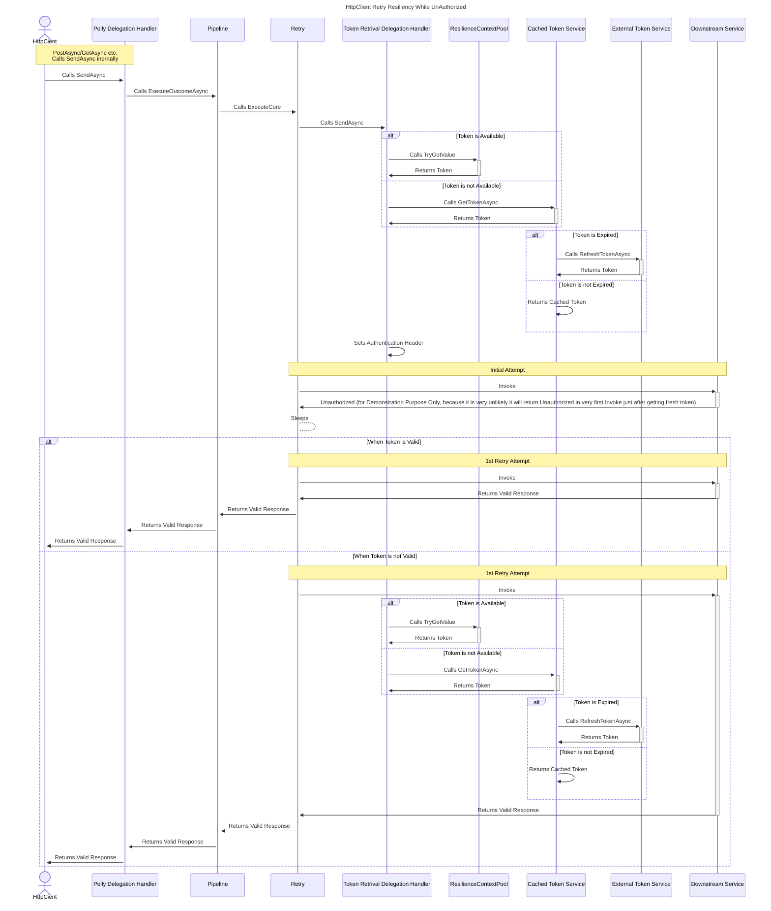

Hi Everyone!

This is continuation of the series of posts on Polly v8 and .NET 8. 

In this series of posts, I will try to cover some of the new features of Polly v8 and .NET 8. Below are the topics I am planning to cover in this series :

[Implementing Retry Strategy for HttpClientFactory using Polly(v8) and .NET 8](/post/implementing-retry-strategy-using-httpclientfactory-with-pollyv8-and-.net-8/)

_This Post - Re-Authorize Efficiently Using Polly And .NET HttpClientFactory in .NET 8_

[Implementing Timeout Strategy for HttpClientFactory using Polly(v8) and .NET 8](#)

[Implementing CircuitBreaker Strategy for HttpClientFactory using Polly(v8) and .NET 8](#)

[Implementing RateLimiter Strategy for HttpClientFactory using Polly(v8) and .NET 8](#)

[Implementing Multiple Strategy for HttpClientFactory using Polly(v8) and .NET 8](#)

[Implementing Telemetry for HttpClientFactory using Polly(v8) and .NET 8](#)

In the last post, we have seen how to implement Retry Strategy for HttpClientFactory using Polly(v8) and .NET 8. In this post, we will see how to re-authorize efficiently using Polly and .NET HttpClientFactory in .NET 8.

> Please note, This post is only for __.NET 8__. if you want to use **Polly v8** along with **.NET 7** then please refer to [this](/post/use-httpclientfactory-with-pollyv8-to-implement-resilient-http-requests/) post because **Microsoft.Extensions.Http.Resilience** not supported in .NET 7, For **Polly v8** along with **.NET 6** probably this post will help you however I have not tested it yet. But the post for _.NET 7_ will definitely help you to implement the same in _.NET 6_.

>Also note, You can refer this [post](/post/re-authorize-efficiently-using-polly-and-httpclientfactory/) if you are not using **Polly v8**.

### Setup
For demonstration purpose, I have created a .NET 8 Web API project so that we can inject fault in our API randomly. 

Our API is very simple and it has only one endpoint to get the weather forecast. Below is the implementation of the same - 

using Microsoft.AspNetCore.Mvc;

var builder = WebApplication.CreateBuilder(args);

builder.Services.AddEndpointsApiExplorer();
builder.Services.AddSwaggerGen();

var app = builder.Build();

if (app.Environment.IsDevelopment())
{
    app.UseSwagger();
    app.UseSwaggerUI();
}

app.UseHttpsRedirection();

// Weather API
var summaries = new[]
{
    "Freezing", "Bracing", "Chilly", "Cool", "Mild", "Warm", "Balmy", "Hot", "Sweltering", "Scorching"
};

app.MapGet("/weatherforecast",  ([FromHeader(Name = "Authorization")] string customHeader) =>
{
    var rnd = Random.Shared.Next(0, 100);

    Console.WriteLine(customHeader);

    switch (rnd)
    {
        case > 60:
            return Results.Problem("Something went wrong");
        case > 30:
            return Results.Unauthorized();
        default:
        {
            var forecast = Enumerable.Range(1, 5).Select(index =>
                    new WeatherForecast
                    (
                        DateOnly.FromDateTime(DateTime.Now.AddDays(index)),
                        Random.Shared.Next(-20, 55),
                        summaries[Random.Shared.Next(summaries.Length)]
                    ))
                .ToArray();
            return Results.Ok(forecast);
        }
    }
})
.WithName("GetWeatherForecast")
.WithOpenApi();

app.Run();

record WeatherForecast(DateOnly Date, int TemperatureC, string? Summary)
{
    public int TemperatureF => 32 + (int)(TemperatureC / 0.5556);
}



We have another console application which will call this API. Below is the implementation of the same - 

using System;
using System.Net;
using System.Net.Http;
using System.Threading.Tasks;
using Microsoft.Extensions.DependencyInjection;
using Microsoft.Extensions.Hosting;
using Microsoft.Extensions.Http.Resilience;
using Polly;
using Sundry.HttpClientDemisfied.Console;

var builder = Host.CreateApplicationBuilder(args);

builder.Services.AddMemoryCache();
builder.Services.AddSingleton<ICachedTokenService, CachedTokenService>();
builder.Services.AddSingleton<IExternalTokenService, ExternalTokenService>();

builder.Services.AddTransient<TokenRetrievalHandler>();

var httpClientBuilder = builder.Services.AddHttpClient<IWeatherForecast, WeatherForecast>(client =>
{
    client.BaseAddress = new Uri("http://localhost:5298/");
});
    httpClientBuilder.AddResilienceHandler("Retry", (resiliencePipelineBuilder, context) =>
    {
        resiliencePipelineBuilder
            .AddRetry(new HttpRetryStrategyOptions
            {
                ShouldHandle = args => args.Outcome switch
                {
                    { Exception: HttpRequestException } => PredicateResult.True(),
                    { Result.StatusCode: HttpStatusCode.Unauthorized } => PredicateResult.False(),
                    { Result.IsSuccessStatusCode: false } => PredicateResult.True(),
                    _ => PredicateResult.False()
                },
                MaxRetryAttempts = 3,
                Delay = TimeSpan.FromSeconds(10),
                UseJitter = true
            })
            .AddRetry(new HttpRetryStrategyOptions
            {
                ShouldHandle = args => args.Outcome switch
                {
                    { Result.StatusCode: HttpStatusCode.Unauthorized } => PredicateResult.True(),
                    _ => PredicateResult.False()
                },
                MaxRetryAttempts = 3,
                Delay = TimeSpan.FromSeconds(10),
                UseJitter = true,
                OnRetry = async (outcome) =>
                {
                    await context.ServiceProvider.GetRequiredService<ICachedTokenService>().RefreshTokenAsync(outcome.Context);
                }
            });
    });

    httpClientBuilder.AddHttpMessageHandler<TokenRetrievalHandler>();

using var host = builder.Build();
await ExemplifyServiceLifetime(host.Services);

await host.RunAsync();
return;

async Task ExemplifyServiceLifetime(IServiceProvider hostProvider)
{
    using var scope = hostProvider.CreateScope();
    var provider = scope.ServiceProvider;
    var weatherForecast = provider.GetRequiredService<IWeatherForecast>();
    var forecasts = await weatherForecast.GetWeatherForecastAsync();
    if (forecasts is not null)
    {
        foreach (var forecast in forecasts)
        {
            Console.WriteLine(forecast);
        }
    }
}


Couple of things to note here -

1. We are using **Microsoft.Extensions.Http.Resilience** package to implement the retry strategy, which is a wrapper around **Polly v8** and provides a way to implement Polly strategies for HttpClientFactory in .NET 8.

2. We are using **AddResilienceHandler** to add the retry strategies. We are using two different retry strategy here. First one is to retry 3 times with a delay of 10 seconds in case of any transient error. Second one is to retry 3 times with a delay of 10 seconds in case of _Unauthorized_ error. Also, we are refreshing the _Token_ in case of _Unauthorized_ error.

3. We are using **AddHttpMessageHandler** to add the **TokenRetrievalHandler** to intercept the call and add the _Token_ in the header while retrying.

3. We are using **ICachedTokenService** to get the _Token_ from the memory cache and refresh it from **IExternalTokenService** when it is expired.

4. We are using **IExternalTokenService** to get the actual _Token_ from external service like _Auth0_ and refresh it when it is expired.

5. We are using **AddHttpClient** to add the **IWeatherForecast** as HttpClient.

### Explanation
Let's start with the **AccessToken** record which will be used to store the _Token_ - 

public record Token
{
    public static Token Empty => new();

    [JsonPropertyName("token_type")]
    public string Scheme { get; set; } = default!;

    [JsonPropertyName("access_token")]
    public string AccessToken { get; set; } = default!;

    [JsonPropertyName("expires_in")]
    public double ExpiresIn { get; set; } = default!;
}


Next, To simulate the scenario, we are generating a random _Guid_ as _Token_ from __IExternalTokenService__. Abstartion for the same is as below -

public interface IExternalTokenService
{
    Task<Token> GetTokenAsync();
}


Below is the implementation of the same -

public class ExternalTokenService : IExternalTokenService
{
    public Task<Token> GetTokenAsync()=>  Task.FromResult(new Token()
            { AccessToken = Guid.NewGuid().ToString("N"), ExpiresIn = 3900, Scheme = "Bearer" });
    
}



In real world, we will get the _Token_ from external service like _Auth0_ / _Azure Entra_ etc.

Next, we will create the abstraction for **ICachedTokenService** as below -

public interface ICachedTokenService
{
    ValueTask<Token> GetTokenAsync(ResilienceContext context);
    Task<Token> RefreshTokenAsync(ResilienceContext context);
}


Below is the implementation of the same -

public class CachedTokenService : ICachedTokenService
{   
    private const string CacheKey = nameof(CachedTokenService);
    private readonly IMemoryCache _memoryCache;
    private readonly IExternalTokenService _externalTokenService;
    public CachedTokenService(IMemoryCache memoryCache, IExternalTokenService externalTokenService)
    {
        _memoryCache = memoryCache;
        _externalTokenService = externalTokenService;
    }
    public async ValueTask<Token> GetTokenAsync(ResilienceContext context)
    {
        if (!_memoryCache.TryGetValue(CacheKey, out Token? cacheValue))
        {
            cacheValue = await RefreshTokenAsync(context);
        }
        return cacheValue!;
    }

    public async Task<Token> RefreshTokenAsync(ResilienceContext context)
    {
        var token = await _externalTokenService.GetTokenAsync();
        
        if (token != Token.Empty)
        {
           var expiresIn = token.ExpiresIn>0?token.ExpiresIn-10:token.ExpiresIn;
           
           _memoryCache.Set(CacheKey, token, new MemoryCacheEntryOptions()
                .SetSlidingExpiration(TimeSpan.FromMinutes(5))
                .SetAbsoluteExpiration(TimeSpan.FromSeconds(expiresIn)));        
        }

        context.Properties.Set(new ResiliencePropertyKey<Token>("AccessKey"), token);
        
        return token;
    }
}


Here, couple of things to note - 

1. We are using **ValueTask** for _GetTokenAsync_. This is because we know that the __Hot path__ will be to get the _Token_ from the memory cache and very few scenraio(e.g very first time when Downstream is getting hit) it will actualy call the **External Auth Server**. So, we are using **ValueTask** to avoid the overhead of allocating a new Task in the heap.

2. We are using _SetAbsoluteExpiration_ and _SetSlidingExpiration_ both to make sure we are not overwhelming by storing the unused _Token_ in the memory cache. Also to avoid edge case when the _Token_ is expired but not yet refreshed we are making sure it removed from the cache before it's actual expiry time.

3. We are using **ResilienceContext** from _Polly_ to store the _Token_ in the context so that we can use it in **TokenRetrievalHandler**.

Next, we will write custom _DelegationHandler_ to intercept the call and add the _Token_ in the header while retrying. Below is the implementation of the same - 

public class TokenRetrievalHandler : DelegatingHandler
{   
    private readonly ICachedTokenService _cachedTokenService;

    public TokenRetrievalHandler(ICachedTokenService cachedTokenService)
    {
        _cachedTokenService = cachedTokenService;
    }
    protected override async Task<HttpResponseMessage> SendAsync(HttpRequestMessage request, CancellationToken cancellationToken)
    {
        var context =  ResilienceContextPool.Shared.Get(cancellationToken);
        context.Properties.TryGetValue(new ResiliencePropertyKey<Token>("AccessToken"), out var token);
       
        token ??= await _cachedTokenService.GetTokenAsync(context);

        request.Headers.Authorization = new AuthenticationHeaderValue(token.Scheme, token.AccessToken);
        return await base.SendAsync(request, cancellationToken);
    }
}


Things to note here -

1. We are using **ResilienceContextPool** from _Polly_ to get the context and then get the _Token_ from the context. If the _Token_ is not available in the context then we are getting it from **ICachedTokenService**.

2. We are adding the _Token_ in the _AuthenticationHeader_.

At last, we will create the abstraction for **IWeatherForecast** as below -

public interface IWeatherForecast
{ 
    Task<IEnumerable<Weather>?> GetWeatherForecastAsync();
}


Below is the implementation of the same -

public class  WeatherForecast : IWeatherForecast{
    private readonly HttpClient _httpClient;

    public WeatherForecast(HttpClient httpClient)
    {
        _httpClient = httpClient;
    }

    public async Task<IEnumerable<Weather>?> GetWeatherForecastAsync()
    {
        var response = await _httpClient.GetAsync("/weatherforecast");
        response.EnsureSuccessStatusCode();
        return await response.Content.ReadFromJsonAsync<IEnumerable<Weather>>();
    }   
}

public record Weather(DateOnly Date, int TemperatureC, string? Summary);


All the pieces are in place. Now, we just need to orchestrate the flow. Let's revisit the **Program.cs** file where we are configuring the HttpClientFactory - 

var httpClientBuilder = builder.Services.AddHttpClient<IWeatherForecast, WeatherForecast>(client =>
{
    client.BaseAddress = new Uri("http://localhost:5298/");
});
    httpClientBuilder.AddResilienceHandler("Retry", (resiliencePipelineBuilder, context) =>
    {
        resiliencePipelineBuilder
            .AddRetry(new HttpRetryStrategyOptions
            {
                ShouldHandle = args => args.Outcome switch
                {
                    { Exception: HttpRequestException } => PredicateResult.True(),
                    { Result.StatusCode: HttpStatusCode.Unauthorized } => PredicateResult.False(),
                    { Result.IsSuccessStatusCode: false } => PredicateResult.True(),
                    _ => PredicateResult.False()
                },
                MaxRetryAttempts = 3,
                Delay = TimeSpan.FromSeconds(10),
                UseJitter = true
            })
            .AddRetry(new HttpRetryStrategyOptions
            {
                ShouldHandle = args => args.Outcome switch
                {
                    { Result.StatusCode: HttpStatusCode.Unauthorized } => PredicateResult.True(),
                    _ => PredicateResult.False()
                },
                MaxRetryAttempts = 3,
                Delay = TimeSpan.FromSeconds(10),
                UseJitter = true,
                OnRetry = async (outcome) =>
                {
                    await context.ServiceProvider.GetRequiredService<ICachedTokenService>().RefreshTokenAsync(outcome.Context);
                }
            });
    });

    httpClientBuilder.AddHttpMessageHandler<TokenRetrievalHandler>();


**AddResilienceHandler** is an extension method provided by **Microsoft.Extensions.Http.Resilience** package. It takes two parameters, first one is the name of the pipeline and second one is the action to configure the pipeline. It does not return __IHttpClientBuilder__ instead it returns __IHttpResiliencePipelineBuilder__ provides a way to configure the resilience pipeline.

Hence, we are keeping the reference of _IHttpClientsBuilder_ in **httpClientBuilder** and then using it to configure the pipeline and adding the **TokenRetrievalHandler** to intercept the call and add the _Token_ in the header while retrying.

### Sequence Diagram
Below is the sequence diagram for the same -

### Result
Finally, we are ready to run the application. Let's run the **Web API** first and then **Console Application**. 

In my case, below is the output of the **Console** - 



and below is the output of the **Web API** - 



Let's try to understand the output -

1. Very first attempt is unsuccessful and it is returning **500** which can be seen from the **Console** output. Since we are capturing the _Authorization_ header in the **Web API** we can see that the _Token_ is also getting logged in the **Web API** output. In our case, it is **Bearer 201bf10e73164ea288ddc21d58fa0964**. This is will be handled by the first retry strategy which is to retry 3 times with a delay of 10 seconds in case of any transient error.

2. Second attempt is also unsuccessful and it is returning **401**. In this case we could see 
the same _Token_ is getting logged in the **Web API** output as expected.

3. Since in the second attempt we got **401** which is handled by the second retry strategy which is to retry 3 times with a delay of 10 seconds in case of _Unauthorized_ error. This will refresh the _Token_ and then retry the call. In our case, we could see that the _Token_ is getting refreshed and the different _Token_ is getting logged in the **Web API** output.In our case, it is **Bearer a4b1af59a33e46db8251ff7bb5d4a5c4**.

4. To keep it short, I will not go through the third attempt. But I hope you got the idea that in case of _Unauthorized_ error, it will refresh the _Token_ and then retry the call and in case of any other error it will retry the call without refreshing the _Token_.

5. Let's jump to the last attempt which is successful and it is returning **200**. Before retrying the call, it will refresh the _Token_ as it got **401** in the previous attempt. In this case we could see that the different _Token_ is getting logged in the **Web API** output as expected, which is **Bearer 503b1c11dc66449cabf20fa04198c816**.

### Conclusion
IMO, it is now more easier to implement than the pervious version of Polly. But I did had a hard time to figure out how to add _DelegationHandler_ while retrying, because the documentation is not very clear on that. I hope this post will help you to implement the same.

You can find the complete source code [here](https://github.com/anktsrkr/Sundry.HttpClientDemisfied)