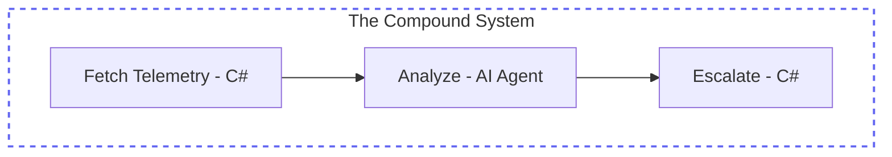

## Overview

In the previous journey, you helped **Jordan Miller** build a powerful, stateful AI agent. It can reason, use tools, and remember conversations. However, as Jordan began deploying this assistant to handle critical production incidents, they noticed a challenge: **Reliability at Scale**.

When an agent has complete autonomy, its path is "probabilistic." It might choose to call a tool, or it might just explain why it thinks it doesn't need to. In high-stakes environments, you often need **Determinism**—guaranteed steps that happen every time, wrapped around the AI's "Smart Brain."

In this module, we transition from building **Agents** to building **Compound AI Systems**.

## System Anatomy

We are shifting from single-agent patterns to **Compound AI Systems**. In this path, we will build out the core concepts of the Agent Framework Workflows.

<div class="grid grid-cols-2 md:grid-cols-3 lg:grid-cols-6 gap-3 my-10">
  <!-- Workflows (Active) -->
  <div class="p-4 rounded-xl bg-white border-2 border-indigo-500 shadow-md relative overflow-hidden transition-all hover:-translate-y-1">
    <div class="absolute top-0 right-0 px-1.5 py-0.5 bg-indigo-500 text-[8px] font-black text-white rounded-bl-lg tracking-tighter uppercase">Building</div>
    <div class="w-8 h-8 rounded-lg bg-indigo-50 flex items-center justify-center text-lg mb-3 border border-indigo-100">🔄</div>
    <div class="font-bold text-slate-900 mb-0.5 text-xs">Workflows</div>
    <p class="text-[10px] leading-relaxed text-slate-600 font-medium">Graph execution.</p>
  </div>

  <!-- Executors (Upcoming) -->
  <div class="p-4 rounded-xl bg-slate-50/50 border border-slate-200/60 shadow-sm opacity-50 grayscale transition-all relative overflow-hidden hover:grayscale-0 hover:opacity-100">
    <div class="absolute top-0 right-0 px-1.5 py-0.5 bg-amber-500 text-[8px] font-black text-white rounded-bl-lg tracking-tighter uppercase">Upcoming</div>
    <div class="w-8 h-8 rounded-lg bg-white shadow-sm flex items-center justify-center text-lg mb-3 border border-slate-100">⚙️</div>
    <div class="font-bold text-slate-900 mb-0.5 text-xs">Executors</div>
    <p class="text-[10px] leading-relaxed text-slate-500">Processing units.</p>
  </div>

  <!-- Edges (Upcoming) -->
  <div class="p-4 rounded-xl bg-slate-50/50 border border-slate-200/60 shadow-sm opacity-50 grayscale transition-all relative overflow-hidden hover:grayscale-0 hover:opacity-100">
    <div class="absolute top-0 right-0 px-1.5 py-0.5 bg-amber-500 text-[8px] font-black text-white rounded-bl-lg tracking-tighter uppercase">Upcoming</div>
    <div class="w-8 h-8 rounded-lg bg-white shadow-sm flex items-center justify-center text-lg mb-3 border border-slate-100">🔀</div>
    <div class="font-bold text-slate-900 mb-0.5 text-xs">Edges</div>
    <p class="text-[10px] leading-relaxed text-slate-500">Message routing.</p>
  </div>

  <!-- Events (Upcoming) -->
  <div class="p-4 rounded-xl bg-slate-50/50 border border-slate-200/60 shadow-sm opacity-50 grayscale transition-all relative overflow-hidden hover:grayscale-0 hover:opacity-100">
    <div class="absolute top-0 right-0 px-1.5 py-0.5 bg-amber-500 text-[8px] font-black text-white rounded-bl-lg tracking-tighter uppercase">Upcoming</div>
    <div class="w-8 h-8 rounded-lg bg-white shadow-sm flex items-center justify-center text-lg mb-3 border border-slate-100">📊</div>
    <div class="font-bold text-slate-900 mb-0.5 text-xs">Events</div>
    <p class="text-[10px] leading-relaxed text-slate-500">Observability.</p>
  </div>

  <!-- State (Upcoming) -->
  <div class="p-4 rounded-xl bg-slate-50/50 border border-slate-200/60 shadow-sm opacity-50 grayscale transition-all relative overflow-hidden hover:grayscale-0 hover:opacity-100">
    <div class="absolute top-0 right-0 px-1.5 py-0.5 bg-amber-500 text-[8px] font-black text-white rounded-bl-lg tracking-tighter uppercase">Upcoming</div>
    <div class="w-8 h-8 rounded-lg bg-white shadow-sm flex items-center justify-center text-lg mb-3 border border-slate-100">💾</div>
    <div class="font-bold text-slate-900 mb-0.5 text-xs">State</div>
    <p class="text-[10px] leading-relaxed text-slate-500">Resiliency.</p>
  </div>

  <!-- Hosting (Upcoming) -->
  <div class="p-4 rounded-xl bg-slate-50/50 border border-slate-200/60 shadow-sm opacity-50 grayscale transition-all relative overflow-hidden hover:grayscale-0 hover:opacity-100">
    <div class="absolute top-0 right-0 px-1.5 py-0.5 bg-amber-500 text-[8px] font-black text-white rounded-bl-lg tracking-tighter uppercase">Upcoming</div>
    <div class="w-8 h-8 rounded-lg bg-white shadow-sm flex items-center justify-center text-lg mb-3 border border-slate-100">☁️</div>
    <div class="font-bold text-slate-900 mb-0.5 text-xs">Hosting</div>
    <p class="text-[10px] leading-relaxed text-slate-500">Service boundary.</p>
  </div>
</div>

## The Shift: From Models to Systems

Recent research (notably from **Berkeley BAIR**) highlights a critical shift in the industry: state-of-the-art results for complex tasks are no longer achieved by just "better models," but by **better architectures**.

| Feature | Single Agent (Probabilistic) | Compound System (Deterministic) |
| :--- | :--- | :--- |
| **Logic** | Emergent / Flexible | Defined / Programmatic |
| **Observability** | Opaque "Thinking" | Explicit "Steps" |
| **Reliability** | Variable (Drift) | Consistent (Guaranteed) |
| **Pattern** | Single-Turn Reasoning | Multi-Step Orchestration |

## The "Safe Shell" Pattern

Jordan's new strategy is the **Hybrid AI Pattern**:
1. **The Shell (C#)**: Deterministic code that handles high-stakes data fetching, security checks, and final routing.
2. **The Brain (AI)**: Probabilistic reasoning used only for the parts of the task that are too complex for hard-coded rules.




<div class="premium-gradient agent-mermaid-note">
<h4 class="text-indigo-950 font-black text-lg mb-2">Why this matters?</h4>
      <p class="text-sm text-indigo-900/70">
        By wrapping the Agent in a "Safe Shell," Jordan ensures that telemetry is <strong>always</strong> fetched before the AI starts, and an alert is <strong>always</strong> logged correctly, regardless of how "creative" the AI's response might be.
      </p>
</div>


## Building the Compound System

Jordan knew that while a single AI agent is powerful, it isn't enough to handle a chaotic production incident alone. When Jordan proposed wrapping the agent in deterministic code to Taylor Vance, Taylor asked the critical question: *"If the agent isn't controlling the flow anymore, what is? How do we orchestrate these steps without writing a massive, fragile state machine?"*

The answer is **Microsoft Agent Framework Workflows**. This orchestration layer allows Jordan to build an intelligent, multi-step assembly line that perfectly balances the rigid rules of incident management with the flexible reasoning of an LLM.

Taylor and Jordan realized a fundamental distinction:

<div class="grid grid-cols-1 md:grid-cols-2 gap-6 my-8">
  <div class="p-6 rounded-2xl bg-white border border-slate-200 shadow-sm relative overflow-hidden group hover:border-indigo-300 transition-all">
    <div class="absolute top-0 right-0 w-32 h-32 bg-slate-50 rounded-bl-full -z-10 group-hover:scale-110 transition-transform"></div>
    <div class="w-12 h-12 rounded-xl bg-slate-50 flex items-center justify-center text-2xl mb-4 border border-slate-100">🧠</div>
    <h4 class="text-slate-900 font-black text-lg mb-2">The Agent</h4>
    <p class="text-sm text-slate-600 leading-relaxed">
      Typically driven by an LLM. The steps it takes are <strong>dynamic</strong> and determined by the model based on the context and available tools.
    </p>
  </div>

  <div class="p-6 rounded-2xl bg-white border-2 border-indigo-500 shadow-xl shadow-indigo-500/10 relative overflow-hidden group hover:-translate-y-1 transition-all">
    <div class="absolute top-0 right-0 w-32 h-32 bg-indigo-500/5 rounded-bl-full -z-10 group-hover:scale-110 transition-transform"></div>
    <div class="w-12 h-12 rounded-xl bg-indigo-50 flex items-center justify-center text-2xl mb-4 border border-indigo-100">🔄</div>
    <h4 class="text-indigo-950 font-black text-lg mb-2">The Workflow</h4>
    <p class="text-sm text-indigo-900/80 leading-relaxed">
      A <strong>predefined sequence</strong> of operations. The explicitly defined flow grants Taylor total control over the execution path, external APIs, and human interactions.
    </p>
  </div>
</div>

By leveraging the framework, Jordan can take advantage of several enterprise-grade features:

<div class="grid grid-cols-1 md:grid-cols-2 lg:grid-cols-3 gap-5 my-8">
  <div class="p-5 rounded-2xl bg-white border border-slate-200 shadow-sm hover:shadow-md hover:border-indigo-200 transition-all group">
    <div class="w-10 h-10 rounded-xl bg-emerald-50 flex items-center justify-center text-xl mb-3 border border-emerald-100 group-hover:scale-110 transition-transform">🛡️</div>
    <h4 class="text-slate-900 font-bold text-sm mb-1.5">Type Safety</h4>
    <p class="text-xs text-slate-500 leading-relaxed">
      Strong typing ensures messages flow correctly, providing validation that prevents runtime errors during critical incidents.
    </p>
  </div>
  
  <div class="p-5 rounded-2xl bg-white border border-slate-200 shadow-sm hover:shadow-md hover:border-indigo-200 transition-all group">
    <div class="w-10 h-10 rounded-xl bg-blue-50 flex items-center justify-center text-xl mb-3 border border-blue-100 group-hover:scale-110 transition-transform">🔀</div>
    <h4 class="text-slate-900 font-bold text-sm mb-1.5">Flexible Control Flow</h4>
    <p class="text-xs text-slate-500 leading-relaxed">
      The graph-based architecture intuitively models complex workflows using <strong>executors</strong> and <strong>edges</strong>.
    </p>
  </div>

  <div class="p-5 rounded-2xl bg-white border border-slate-200 shadow-sm hover:shadow-md hover:border-indigo-200 transition-all group">
    <div class="w-10 h-10 rounded-xl bg-amber-50 flex items-center justify-center text-xl mb-3 border border-amber-100 group-hover:scale-110 transition-transform">🔌</div>
    <h4 class="text-slate-900 font-bold text-sm mb-1.5">External Integration</h4>
    <p class="text-xs text-slate-500 leading-relaxed">
      Built-in request/response patterns enable seamless integration with Taylor's APIs and support "Human-in-the-Loop" scenarios.
    </p>
  </div>

  <div class="p-5 rounded-2xl bg-white border border-slate-200 shadow-sm hover:shadow-md hover:border-indigo-200 transition-all group">
    <div class="w-10 h-10 rounded-xl bg-purple-50 flex items-center justify-center text-xl mb-3 border border-purple-100 group-hover:scale-110 transition-transform">💾</div>
    <h4 class="text-slate-900 font-bold text-sm mb-1.5">Checkpointing</h4>
    <p class="text-xs text-slate-500 leading-relaxed">
      By saving workflow states via checkpoints, long-running processes can recover and resume on the server side if interrupted.
    </p>
  </div>

  <div class="p-5 rounded-2xl bg-white border border-slate-200 shadow-sm hover:shadow-md hover:border-indigo-200 transition-all group">
    <div class="w-10 h-10 rounded-xl bg-rose-50 flex items-center justify-center text-xl mb-3 border border-rose-100 group-hover:scale-110 transition-transform">🤖</div>
    <h4 class="text-slate-900 font-bold text-sm mb-1.5">Multi-Agent Orchestration</h4>
    <p class="text-xs text-slate-500 leading-relaxed">
      The framework natively supports coordinating multiple AI agents using sequential, concurrent, and hand-off patterns.
    </p>
  </div>
</div>

### Core Concepts

<div class="grid grid-cols-1 md:grid-cols-2 gap-6 my-8">
  <div class="p-6 rounded-2xl bg-white border border-slate-200 shadow-sm relative overflow-hidden group hover:-translate-y-1 transition-transform">
    <div class="absolute top-0 right-0 w-24 h-24 bg-slate-50 rounded-bl-full -z-10 group-hover:scale-110 transition-transform"></div>
    <div class="flex items-center gap-4 mb-4">
      <div class="w-12 h-12 rounded-xl bg-indigo-50 flex items-center justify-center text-2xl border border-indigo-100">⚙️</div>
      <h4 class="text-slate-900 font-black text-lg m-0">Executors</h4>
    </div>
    <p class="text-sm text-slate-600 leading-relaxed">
      Individual processing units within a workflow. They can be AI agents or custom logic components. They receive input messages, perform specific tasks, and produce output messages.
    </p>
  </div>

  <div class="p-6 rounded-2xl bg-white border border-slate-200 shadow-sm relative overflow-hidden group hover:-translate-y-1 transition-transform">
    <div class="absolute top-0 right-0 w-24 h-24 bg-slate-50 rounded-bl-full -z-10 group-hover:scale-110 transition-transform"></div>
    <div class="flex items-center gap-4 mb-4">
      <div class="w-12 h-12 rounded-xl bg-teal-50 flex items-center justify-center text-2xl border border-teal-100">🔀</div>
      <h4 class="text-slate-900 font-black text-lg m-0">Edges</h4>
    </div>
    <p class="text-sm text-slate-600 leading-relaxed">
      Define the connections between executors, determining the flow of messages. They can include conditions to control routing based on message contents.
    </p>
  </div>

  <div class="p-6 rounded-2xl bg-white border border-slate-200 shadow-sm relative overflow-hidden group hover:-translate-y-1 transition-transform">
    <div class="absolute top-0 right-0 w-24 h-24 bg-slate-50 rounded-bl-full -z-10 group-hover:scale-110 transition-transform"></div>
    <div class="flex items-center gap-4 mb-4">
      <div class="w-12 h-12 rounded-xl bg-amber-50 flex items-center justify-center text-2xl border border-amber-100">📊</div>
      <h4 class="text-slate-900 font-black text-lg m-0">Events</h4>
    </div>
    <p class="text-sm text-slate-600 leading-relaxed">
      Provide observability into workflow execution, including lifecycle events, executor events, and custom events.
    </p>
  </div>

  <div class="p-6 rounded-2xl bg-white border border-slate-200 shadow-sm relative overflow-hidden group hover:-translate-y-1 transition-transform">
    <div class="absolute top-0 right-0 w-24 h-24 bg-slate-50 rounded-bl-full -z-10 group-hover:scale-110 transition-transform"></div>
    <div class="flex items-center gap-4 mb-4">
      <div class="w-12 h-12 rounded-xl bg-rose-50 flex items-center justify-center text-2xl border border-rose-100">🏗️</div>
      <div class="flex flex-col">
        <h4 class="text-slate-900 font-black text-lg m-0 leading-tight">Builder API</h4>
        <span class="text-xs text-slate-500 font-medium uppercase tracking-wider">And Execution</span>
      </div>
    </div>
    <p class="text-sm text-slate-600 leading-relaxed">
      Ties executors and edges together into a directed graph, manages execution via supersteps, and supports streaming and non-streaming modes.
    </p>
  </div>
</div>

Here is how Jordan translates these concepts into grounded code to build a reliable incident triage pipeline:

```csharp
// 1. Define specialized executors (custom C# logic and AI Agents)
Executor fetchTelemetry = new FetchTelemetryExecutor();
AIAgent triageAgent = ...; // The "Smart Brain"
Executor escalationEngine = new EscalationEngineExecutor();

// 2. Tie executors and edges together into a directed graph
WorkflowBuilder builder = new(fetchTelemetry);
builder.AddEdge(fetchTelemetry, triageAgent);
builder.AddEdge(triageAgent, escalationEngine);
Workflow workflow = builder.Build();

// 3. Execute the workflow with streaming observability
await using StreamingRun run = await InProcessExecution.RunStreamingAsync(workflow, "checkout failures");

await foreach (WorkflowEvent evt in run.WatchStreamAsync())
{
    if (evt is AgentResponseUpdateEvent update) Console.Write(update.Update.Text);
}
```

## Multi-Agent Patterns

With the `WorkflowBuilder`, you can easily codify common patterns for coordinating multiple components. Instead of one agent doing everything, you can orchestrate specialized units:

### 1. Sequential (The Assembly Line)
Agents or code executors pass data linearly. Good for rigid processes like "Translate → Summarize → Email."

### 2. Concurrent (The Panel of Experts)
Run multiple agents at once to get diverse perspectives or process data faster.

### 3. Handoffs (The Support Desk)
A "Router" agent determines which specialized agent is best suited for the current task.

## Summary & Next Steps

You've moved from thinking about **who** the agent is to **how** the system flows. By adopting the **Compound AI** mindset, you've given Jordan the tools to build systems that are as reliable as they are intelligent.

In the **[next tutorial](/post/agent-framework/academy/advanced-orchestration/orchestrate-workflows/)**, we will build Jordan's first professional assembly line: a multi-step **Incident Triage Workflow**.
