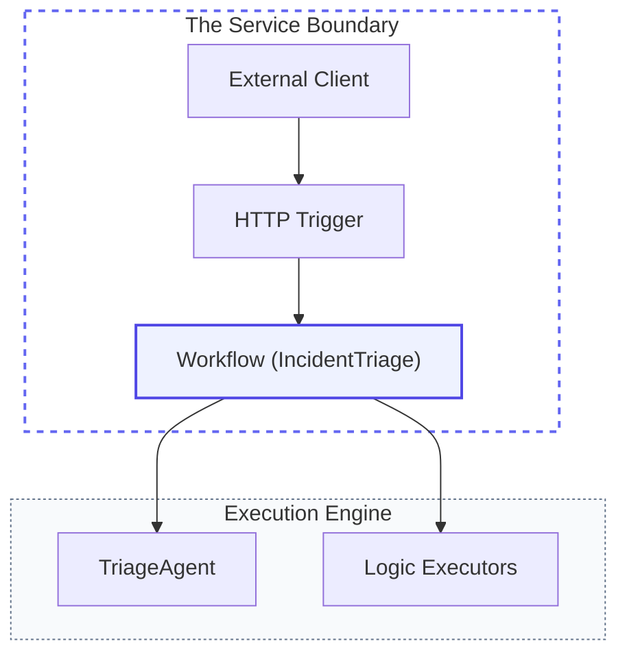
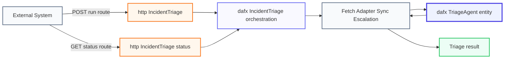

## Overview

Jordan Miller's incident triage assistant now has all the core building blocks: a defined **Persona**, a reasoning **Brain**, external **Tools**, persistent **Memory**, and a structured **Workflow**. The final step is to take this compound system out of the terminal and make it reachable by other systems.

In this final module of the **Advanced Orchestration** path, we will host the entire workflow as a **Service** using Azure Functions and Durable Agents. This transforms Jordan's local orchestration into a scalable API endpoint that can be invoked by monitoring systems, Slack bots, or automated incident triggers.

## System Anatomy

We have reached the final pillar: **Hosting**. This is the bridge that connects your compound AI system to the rest of the enterprise.

<div class="grid grid-cols-2 md:grid-cols-3 lg:grid-cols-6 gap-3 my-10">
  <!-- Workflows (Mastered) -->
  <div class="p-4 rounded-xl bg-slate-50/50 border border-slate-200/60 shadow-sm opacity-50 grayscale transition-all hover:grayscale-0 hover:opacity-100">
    <div class="w-8 h-8 rounded-lg bg-white shadow-sm flex items-center justify-center text-lg mb-3 border border-slate-100">🔄</div>
    <div class="font-bold text-slate-900 mb-0.5 text-xs">Workflows</div>
    <p class="text-[10px] leading-relaxed text-slate-500">Graph execution.</p>
  </div>

  <!-- Executors (Mastered) -->
  <div class="p-4 rounded-xl bg-slate-50/50 border border-slate-200/60 shadow-sm opacity-50 grayscale transition-all hover:grayscale-0 hover:opacity-100">
    <div class="w-8 h-8 rounded-lg bg-white shadow-sm flex items-center justify-center text-lg mb-3 border border-slate-100">⚙️</div>
    <div class="font-bold text-slate-900 mb-0.5 text-xs">Executors</div>
    <p class="text-[10px] leading-relaxed text-slate-500">Processing units.</p>
  </div>

  <!-- Edges (Mastered) -->
  <div class="p-4 rounded-xl bg-slate-50/50 border border-slate-200/60 shadow-sm opacity-50 grayscale transition-all hover:grayscale-0 hover:opacity-100">
    <div class="w-8 h-8 rounded-lg bg-white shadow-sm flex items-center justify-center text-lg mb-3 border border-slate-100">🔀</div>
    <div class="font-bold text-slate-900 mb-0.5 text-xs">Edges</div>
    <p class="text-[10px] leading-relaxed text-slate-500">Message routing.</p>
  </div>

  <!-- Events (Mastered) -->
  <div class="p-4 rounded-xl bg-slate-50/50 border border-slate-200/60 shadow-sm opacity-50 grayscale transition-all hover:grayscale-0 hover:opacity-100">
    <div class="w-8 h-8 rounded-lg bg-white shadow-sm flex items-center justify-center text-lg mb-3 border border-slate-100">📊</div>
    <div class="font-bold text-slate-900 mb-0.5 text-xs">Events</div>
    <p class="text-[10px] leading-relaxed text-slate-500">Observability.</p>
  </div>

  <!-- State (Mastered) -->
  <div class="p-4 rounded-xl bg-slate-50/50 border border-slate-200/60 shadow-sm opacity-50 grayscale transition-all hover:grayscale-0 hover:opacity-100">
    <div class="w-8 h-8 rounded-lg bg-white shadow-sm flex items-center justify-center text-lg mb-3 border border-slate-100">💾</div>
    <div class="font-bold text-slate-900 mb-0.5 text-xs">State</div>
    <p class="text-[10px] leading-relaxed text-slate-500">Resiliency.</p>
  </div>

  <!-- Hosting (Active) -->
  <div class="p-4 rounded-xl bg-white border-2 border-indigo-500 shadow-md relative overflow-hidden transition-all hover:-translate-y-1">
    <div class="absolute top-0 right-0 px-1.5 py-0.5 bg-indigo-500 text-[8px] font-black text-white rounded-bl-lg tracking-tighter uppercase">Building</div>
    <div class="w-8 h-8 rounded-lg bg-indigo-50 flex items-center justify-center text-lg mb-3 border border-indigo-100">☁️</div>
    <div class="font-bold text-slate-900 mb-0.5 text-xs">Hosting</div>
    <p class="text-[10px] leading-relaxed text-slate-600 font-medium">Service boundary.</p>
  </div>
</div>




<div class="premium-gradient agent-mermaid-note">
<h4 class="text-indigo-950 font-black text-lg tracking-tight mb-2">The "Workflow-as-a-Service" Architecture</h4>
      <p class="text-sm leading-relaxed text-indigo-900/70">
        Most enterprise assistants don't live in a console window. They live behind <strong>HTTP APIs</strong>. By hosting Jordan's <strong>Triage Workflow</strong> in Azure Functions, we create a clear service boundary. 
      </p>
      <ul class="mt-4 space-y-2 text-xs text-indigo-900/60 list-none p-0">
        <li class="flex items-center gap-2">✅ <strong>Accessibility</strong>: Any internal system can now "ask" for triage via standard JSON/HTTP.</li>
        <li class="flex items-center gap-2">✅ <strong>Scalability</strong>: Azure Functions handle the heavy lifting of scaling the agent host.</li>
        <li class="flex items-center gap-2">✅ <strong>Persistence</strong>: Leveraging the Durable backend ensures that workflow progress and agent memory are automatically preserved.</li>
      </ul>
</div>


## Setup your environment

Hosting a workflow as a service requires the Azure Functions Core Tools and a Durable Task backend.

<div class="solid-callout solid-callout-info mb-8">
  <p class="font-bold text-indigo-900 mb-3 text-base">📋 Pre-flight Checklist</p>
  <ul class="space-y-2.5 m-0 p-0 list-none text-sm text-indigo-900/80">
    <li class="flex items-center gap-2">🛠️ <strong>Functions Core Tools</strong>: Ensure <code>func</code> is available in your terminal.</li>
    <li class="flex items-center gap-2">📦 <strong>Hosting Extension</strong>: We use <code>Microsoft.Agents.AI.Hosting.AzureFunctions</code>.</li>
    <li class="flex items-center gap-2">💾 <strong>Storage Backend</strong>: A Durable Task Scheduler (DTS) must be running.</li>
  </ul>
</div>

<details class="premium-details my-8">
  <summary class="premium-summary">
    <div class="flex items-center gap-3 mb-1">
      <span class="px-2 py-0.5 bg-indigo-100 text-indigo-600 text-[10px] font-black uppercase tracking-widest rounded-md">Prerequisite</span>
      <span class="summary-title text-indigo-950 font-black">Infrastructure: Durable Task Scheduler (DTS)</span>
    </div>
    <span class="summary-subtitle text-slate-500 text-xs">Essential setup for local and cloud orchestration</span>
  </summary>
  <div class="premium-details-content">
    <p class="text-sm text-slate-600 mb-6">
      The Agent Framework uses the <strong>Durable Task Scheduler (DTS)</strong> to manage the state and coordination of your workflows.
    </p>

    <div class="solid-callout solid-callout-info mb-6">
      <p class="font-bold text-indigo-900 mb-2 text-xs uppercase tracking-wider">Configuration: host.json</p>
      <p class="text-[11px] text-indigo-900/60 mb-3">Add the following to your project's <code>host.json</code> to enable the Durable Task extension:</p>

```json
{
  "extensions": {
    "durableTask": {
      "storageProvider": {
        "type": "azureManaged",
        "connectionStringName": "DurableTaskSchedulerConnectionString"
      }
    }
  }
}
```
    </div>

    
      

#### Local Emulator (Docker)

<p class="text-[10px] font-black uppercase tracking-widest text-slate-400 mb-2">1. Start the Emulator</p>
<div class="bg-slate-900 rounded-xl p-4 mb-6 border border-slate-800 shadow-inner group relative overflow-hidden">
  <div class="flex items-center justify-between mb-3 border-b border-slate-800 pb-2">
    <div class="flex gap-1.5">
      <div class="w-2 h-2 rounded-full bg-red-500/40"></div>
      <div class="w-2 h-2 rounded-full bg-amber-500/40"></div>
      <div class="w-2 h-2 rounded-full bg-emerald-500/40"></div>
    </div>
    <span class="text-[9px] font-bold text-slate-500 uppercase tracking-widest">DTS Emulator</span>
  </div>
  <code class="text-indigo-300 text-xs block leading-relaxed break-all font-mono">
    docker run -p 8080:8080 -p 8082:8082 mcr.microsoft.com/durabletask/scheduler-emulator:latest
  </code>
  <div class="mt-4 flex items-center gap-6">
    <div class="flex items-center gap-2">
      <div class="w-1.5 h-1.5 rounded-full bg-indigo-500 animate-pulse"></div>
      <span class="text-[10px] text-slate-400 font-bold uppercase tracking-tighter">Port 8080: gRPC API</span>
    </div>
    <div class="flex items-center gap-2">
      <div class="w-1.5 h-1.5 rounded-full bg-emerald-500"></div>
      <span class="text-[10px] text-slate-400 font-bold uppercase tracking-tighter">Port 8082: Dashboard</span>
    </div>
  </div>
</div>

<p class="text-[10px] font-black uppercase tracking-widest text-slate-400 mb-2">2. Connection String</p>
<p class="text-[11px] text-slate-500 mb-2">Add this to your <code class="text-[10px] bg-slate-100 px-1 rounded text-indigo-600 font-custom">local.settings.json</code>:</p>
<code class="block py-3 px-4 bg-slate-50 rounded-xl border border-slate-200 text-indigo-600 font-mono text-[11px]">"DurableTaskSchedulerConnectionString": "Endpoint=http://localhost:8080;Authentication=None"</code>


      

#### Azure (Cloud)

<p class="text-[10px] font-black uppercase tracking-widest text-slate-400 mb-2">1. Provision Resource</p>
<p class="text-[11px] text-slate-500 mb-4">Deploy a <strong>Durable Task Scheduler</strong> instance via the Azure Portal or Bicep templates.</p>
<p class="text-[10px] font-black uppercase tracking-widest text-slate-400 mb-2">2. Assign Permissions</p>
<p class="text-[11px] text-slate-500 mb-4">Enable <strong>Managed Identity</strong> on your Function App and assign it the <code class="text-[10px] bg-slate-100 px-1 rounded text-indigo-600 font-custom">Durable Task Data Contributor</code> role on the DTS resource.</p>
<p class="text-[10px] font-black uppercase tracking-widest text-slate-400 mb-2">3. Connection String</p>
<p class="text-[11px] text-slate-500 mb-2">Set this in your App Configuration or <code class="text-[10px] bg-slate-100 px-1 rounded text-indigo-600 font-custom">local.settings.json</code>:</p>
<code class="block mt-2 py-2 px-3 bg-slate-100 rounded text-indigo-600 font-mono text-[10px]">"DurableTaskSchedulerConnectionString": "Endpoint=https://your-scheduler.durabletask.io;Authentication=ManagedIdentity"</code>


    

    <div class="solid-callout solid-callout-info mt-6">
      <p class="font-bold text-indigo-900 mb-2 text-sm">🛠️ Tooling: Azure Functions Core Tools</p>
      <p class="text-xs text-indigo-900/80 leading-relaxed">
        To scaffold and run your workflow host, you need the <strong>Azure Functions Core Tools (v4.x)</strong>. If you don't have them yet, [follow the official installation guide](https://learn.microsoft.com/en-us/azure/azure-functions/functions-run-local) for your platform.
      </p>
    </div>
  </div>
</details>

<div class="solid-callout solid-callout-info my-10">
  <p class="font-bold text-indigo-900 mb-2 text-sm">🌐 Choosing Your Hosting Model</p>
  <p class="text-xs text-indigo-900/80 leading-relaxed font-medium">
    The <strong>Agent Framework</strong> leverages the Durable Task engine, giving you two primary hosting paths depending on your infrastructure needs:
  </p>
  <ul class="text-[11px] text-indigo-900/70 list-disc ml-4 mt-2 space-y-1">
    <li><strong>Azure Functions (Durable Functions):</strong> What we use here. It offers deep Azure integration, built-in HTTP management, and flexible storage options.</li>
    <li><strong>Standalone SDKs:</strong> Ideal for self-hosting on any platform (Kubernetes, IoT Edge, etc.) where you want to manage the host yourself.</li>
  </ul>
  <p class="text-xs text-indigo-900/80 mt-3 leading-relaxed">
    [Learn more about choosing an orchestration framework](https://learn.microsoft.com/en-us/azure/durable-task/common/choose-orchestration-framework).
  </p>
</div>


## Build the Host

To host our workflow, we use the **Microsoft Agent Framework Hosting** extension. We are exposing the **entire multi-step Workflow** we built previously as a reachable API. 

### <span class="step-pill">1</span> Initialize the Project

First, create a new Azure Functions project using the **Azure Functions Core Tools**. We will use the **Isolated Worker Model**, which is the modern standard for .NET functions.

```bash
func init IncidentTriageWorkflow.Host --worker-runtime dotnet-isolated --target-framework net10.0
cd IncidentTriageWorkflow.Host
```


  

#### OpenAI Compatible (LM Studio)

```bash
dotnet add package Microsoft.Agents.AI.Hosting.AzureFunctions
dotnet add package Microsoft.Agents.AI.OpenAI
dotnet add package Microsoft.Agents.AI.Workflows
dotnet add package Microsoft.Azure.Functions.Worker.Extensions.DurableTask.AzureManaged
dotnet add package Microsoft.Azure.Functions.Worker.Extensions.Http.AspNetCore
dotnet add package OpenAI
dotnet restore
```

<div class="flex items-center gap-3 my-6 opacity-50">
  <div class="h-[1px] flex-1 bg-slate-200"></div>
  <span class="text-[10px] font-black uppercase tracking-widest text-slate-400">Package Anatomy</span>
  <div class="h-[1px] flex-1 bg-slate-200"></div>
</div>

<div class="grid grid-cols-1 md:grid-cols-3 gap-4 mb-6">
  <div class="p-4 rounded-xl border border-slate-200 bg-white shadow-sm hover:border-indigo-200 hover:shadow-md transition-all">
    <div class="flex items-center gap-2 mb-2">
      <span class="text-xl">☁️</span>
      <code class="text-xs font-bold text-indigo-600 break-all">Microsoft.Agents.AI.Hosting.AzureFunctions</code>
    </div>
    <p class="text-xs text-slate-500 leading-relaxed">The hosting bridge. It provides the <code class="text-[10px] bg-slate-100 px-1 rounded">ConfigureDurableOptions</code> extension to register agents and workflows as HTTP services.</p>
  </div>
  <div class="p-4 rounded-xl border border-slate-200 bg-white shadow-sm hover:border-indigo-200 hover:shadow-md transition-all">
    <div class="flex items-center gap-2 mb-2">
      <span class="text-xl">🔄</span>
      <code class="text-xs font-bold text-indigo-600">Microsoft.Agents.AI.Workflows</code>
    </div>
    <p class="text-xs text-slate-500 leading-relaxed">The core orchestration engine. Required for building multi-step assembly lines like Jordan's incident triage.</p>
  </div>
  <div class="p-4 rounded-xl border border-slate-200 bg-white shadow-sm hover:border-indigo-200 hover:shadow-md transition-all">
    <div class="flex items-center gap-2 mb-2">
      <span class="text-xl">💾</span>
      <code class="text-xs font-bold text-indigo-600 break-all">Microsoft.Azure.Functions.Worker.Extensions.DurableTask.AzureManaged</code>
    </div>
    <p class="text-xs text-slate-500 leading-relaxed">The worker extension that enables the Function app to talk to the Durable Task Scheduler backend.</p>
  </div>
</div>


  

#### Azure OpenAI

```bash
dotnet add package Microsoft.Agents.AI.Hosting.AzureFunctions
dotnet add package Microsoft.Agents.AI.OpenAI
dotnet add package Microsoft.Agents.AI.Workflows
dotnet add package Microsoft.Azure.Functions.Worker.Extensions.DurableTask.AzureManaged
dotnet add package Microsoft.Azure.Functions.Worker.Extensions.Http.AspNetCore
dotnet add package Azure.AI.OpenAI
dotnet add package Azure.Identity
dotnet restore
```

<div class="flex items-center gap-3 my-6 opacity-50">
  <div class="h-[1px] flex-1 bg-slate-200"></div>
  <span class="text-[10px] font-black uppercase tracking-widest text-slate-400">Package Anatomy</span>
  <div class="h-[1px] flex-1 bg-slate-200"></div>
</div>

<div class="grid grid-cols-1 md:grid-cols-3 gap-4 mb-6">
  <div class="p-4 rounded-xl border border-slate-200 bg-white shadow-sm hover:border-indigo-200 hover:shadow-md transition-all">
    <div class="flex items-center gap-2 mb-2">
      <span class="text-xl">☁️</span>
      <code class="text-xs font-bold text-indigo-600 break-all">Microsoft.Agents.AI.Hosting.AzureFunctions</code>
    </div>
    <p class="text-xs text-slate-500 leading-relaxed">The hosting bridge. It provides the <code class="text-[10px] bg-slate-100 px-1 rounded">ConfigureDurableOptions</code> extension to register agents and workflows as HTTP services.</p>
  </div>
  <div class="p-4 rounded-xl border border-slate-200 bg-white shadow-sm hover:border-indigo-200 hover:shadow-md transition-all">
    <div class="flex items-center gap-2 mb-2">
      <span class="text-xl">🔄</span>
      <code class="text-xs font-bold text-indigo-600">Microsoft.Agents.AI.Workflows</code>
    </div>
    <p class="text-xs text-slate-500 leading-relaxed">The core orchestration engine. Required for building multi-step assembly lines like Jordan's incident triage.</p>
  </div>
  <div class="p-4 rounded-xl border border-slate-200 bg-white shadow-sm hover:border-indigo-200 hover:shadow-md transition-all">
    <div class="flex items-center gap-2 mb-2">
      <span class="text-xl">💾</span>
      <code class="text-xs font-bold text-indigo-600 break-all">Microsoft.Azure.Functions.Worker.Extensions.DurableTask.AzureManaged</code>
    </div>
    <p class="text-xs text-slate-500 leading-relaxed">The worker extension that enables the Function app to talk to the Durable Task Scheduler backend.</p>
  </div>
</div>


### <span class="step-pill">2</span> Implement the Hosted Workflow

Replace the contents of `Program.cs` with the following code.


  

#### OpenAI Compatible (LM Studio)

```csharp
using Microsoft.Agents.AI;
using Microsoft.Agents.AI.Hosting.AzureFunctions;
using Microsoft.Agents.AI.Workflows;
using Microsoft.Azure.Functions.Worker.Builder;
using Microsoft.Extensions.AI;
using Microsoft.Extensions.Hosting;
using OpenAI;
using OpenAI.Chat;
using System.ClientModel;
using System.ComponentModel;
using ChatMessage = Microsoft.Extensions.AI.ChatMessage;

// 1. Setup Jordan's Brain
var endpoint = Environment.GetEnvironmentVariable("OPENAI_ENDPOINT") ?? "http://localhost:1234/v1";
var modelName = Environment.GetEnvironmentVariable("OPENAI_MODEL_NAME") ?? "google/gemma-4-e4b";
var chatClient = new OpenAIClient(new ApiKeyCredential("dummy"), new OpenAIClientOptions { Endpoint = new Uri(endpoint) })
    .GetChatClient(modelName);


AIAgent triageAgent = chatClient.AsAIAgent(new ChatClientAgentOptions
{
    Name = "TriageAgent",
    ChatOptions = new()
    {
        Instructions = """
            You are Jordan's on-call assistant. Analyze telemetry and classify incident priority.
            """,
        Tools = [AIFunctionFactory.Create(AssessIncidentPriority, nameof(AssessIncidentPriority))]
    }
});

// 2. Build the Assembly Line (Workflow)
var fetchTelemetry = new FetchTelemetryExecutor();
var triageAdapter = new TriageAdapterExecutor();
var triageSync = new TriageSyncExecutor();
var escalationEngine = new EscalationExecutor();
var triageAgentExecutor = triageAgent.BindAsExecutor(new AIAgentHostOptions { ForwardIncomingMessages = false });

WorkflowBuilder builder = new(fetchTelemetry);
builder.WithName("IncidentTriage");
builder.AddEdge(fetchTelemetry, triageAdapter);
builder.AddEdge(triageAdapter, triageAgentExecutor);
builder.AddEdge(triageAgentExecutor, triageSync);
builder.AddEdge(triageSync, escalationEngine);

var workflow = builder.Build();

// 3. Start the Functions Host
using IHost app = FunctionsApplication
    .CreateBuilder(args)
    .ConfigureFunctionsWebApplication()
    .ConfigureDurableOptions(options =>
    {
        options.Workflows.AddWorkflow(workflow, exposeStatusEndpoint: true);
    })
    .Build();

app.Run();

// --- Logic & Executors ---
[Description("Classifies incident priority from service telemetry.")]
static string AssessIncidentPriority(string serviceName, double errorRatePercent, double latencyMs) => "PRIORITY: P0";

internal sealed class FetchTelemetryExecutor() : Executor<string, string>("FetchTelemetry")
{
    public override ValueTask<string> HandleAsync(string service, IWorkflowContext context, CancellationToken ct = default) => ValueTask.FromResult("[TELEMETRY] Latency: 450ms");
}

[SendsMessage(typeof(ChatMessage))]
internal sealed class TriageAdapterExecutor() : Executor<string>("TriageAdapter")
{
    public override async ValueTask HandleAsync(string message, IWorkflowContext context, CancellationToken ct = default) => await context.SendMessageAsync(new ChatMessage(ChatRole.User, message), ct);
}

internal sealed class TriageSyncExecutor() : Executor<string, string>("TriageSync")
{
    public override ValueTask<string> HandleAsync(string report, IWorkflowContext context, CancellationToken ct = default) => ValueTask.FromResult(report.Trim());
}

internal sealed class EscalationExecutor() : Executor<string, string>("EscalationEngine")
{
    public override ValueTask<string> HandleAsync(string report, IWorkflowContext context, CancellationToken ct = default) => ValueTask.FromResult("ALARM: Paging SRE Team.");
}
```


  

#### Azure OpenAI

```csharp
using Microsoft.Agents.AI;
using Microsoft.Agents.AI.Hosting.AzureFunctions;
using Microsoft.Azure.Functions.Worker.Builder;
using Microsoft.Extensions.AI;
using Microsoft.Extensions.Hosting;
using Azure.AI.OpenAI;
using Azure.Identity;
using OpenAI.Chat;
using System.ComponentModel;
using ChatMessage = Microsoft.Extensions.AI.ChatMessage;

// 1. Setup Jordan's Brain
var endpoint = Environment.GetEnvironmentVariable("AZURE_OPENAI_ENDPOINT")!;
var deploymentName = Environment.GetEnvironmentVariable("AZURE_OPENAI_DEPLOYMENT_NAME")!;
var chatClient = new AzureOpenAIClient(new Uri(endpoint), new DefaultAzureCredential())
    .GetChatClient(deploymentName);

AIAgent triageAgent = chatClient.AsAIAgent(new ChatClientAgentOptions
{
    Name = "TriageAgent",
    ChatOptions = new()
    {
        Instructions = """
            You are Jordan's on-call assistant. Analyze telemetry and classify incident priority.
            """,
        Tools = [AIFunctionFactory.Create(AssessIncidentPriority, nameof(AssessIncidentPriority))]
    }
});

// 2. Build the Assembly Line (Workflow)
var fetchTelemetry = new FetchTelemetryExecutor();
var triageAdapter = new TriageAdapterExecutor();
var triageSync = new TriageSyncExecutor();
var escalationEngine = new EscalationExecutor();
var triageAgentExecutor = triageAgent.BindAsExecutor(new AIAgentHostOptions { ForwardIncomingMessages = false });

WorkflowBuilder builder = new(fetchTelemetry);
builder.WithName("IncidentTriage");
builder.AddEdge(fetchTelemetry, triageAdapter);
builder.AddEdge(triageAdapter, triageAgentExecutor);
builder.AddEdge(triageAgentExecutor, triageSync);
builder.AddEdge(triageSync, escalationEngine);

var workflow = builder.Build();

// 3. Start the Functions Host
using IHost app = FunctionsApplication
    .CreateBuilder(args)
    .ConfigureFunctionsWebApplication()
    .ConfigureDurableOptions(options =>
    {
        options.Workflows.AddWorkflow(workflow, exposeStatusEndpoint: true);
    })
    .Build();

app.Run();

// --- Logic & Executors ---
[Description("Classifies incident priority from service telemetry.")]
static string AssessIncidentPriority(string serviceName, double errorRatePercent, double latencyMs) => "PRIORITY: P0";

internal sealed class FetchTelemetryExecutor() : Executor<string, string>("FetchTelemetry")
{
    public override ValueTask<string> HandleAsync(string service, IWorkflowContext context, CancellationToken ct = default) => ValueTask.FromResult("[TELEMETRY] Latency: 450ms");
}

[SendsMessage(typeof(ChatMessage))]
internal sealed class TriageAdapterExecutor() : Executor<string>("TriageAdapter")
{
    public override async ValueTask HandleAsync(string message, IWorkflowContext context, CancellationToken ct = default) => await context.SendMessageAsync(new ChatMessage(ChatRole.User, message), ct);
}

internal sealed class TriageSyncExecutor() : Executor<string, string>("TriageSync")
{
    public override ValueTask<string> HandleAsync(string report, IWorkflowContext context, CancellationToken ct = default) => ValueTask.FromResult(report.Trim());
}

internal sealed class EscalationExecutor() : Executor<string, string>("EscalationEngine")
{
    public override ValueTask<string> HandleAsync(string report, IWorkflowContext context, CancellationToken ct = default) => ValueTask.FromResult("ALARM: Paging SRE Team.");
}
```


<div class="solid-callout solid-callout-warning my-8">
  <p class="font-bold text-amber-900 mb-2 text-sm">⚠️ Configuration Reminder</p>
  <p class="text-xs text-amber-900/80 leading-relaxed">
    Ensure your <code>local.settings.json</code> contains the <code>AZURE_OPENAI_ENDPOINT</code> and <code>AZURE_OPENAI_DEPLOYMENT_NAME</code> variables, as well as the <code>DurableTaskSchedulerConnectionString</code> required for the host to start.
  </p>
</div>

<div class="solid-callout solid-callout-info my-8">
  <p class="font-bold text-indigo-900 mb-2 text-base">🛡️ Hosted Workflow Turn Handling</p>
  <p class="text-sm text-indigo-900/80 leading-relaxed m-0">
    In the in-process workflow from the previous module, <code>TriageAdapter</code> sends both a <code>ChatMessage</code> and a <code>TurnToken</code>. In this hosted Durable Functions workflow, send only the <code>ChatMessage</code>. The Durable host routes each emitted message across the workflow boundary, so sending a <code>TurnToken</code> here can schedule a second agent invocation with <code>&#123;&quot;emitEvents&quot;:true&#125;</code> as ordinary user input.
  </p>
</div>

### <span class="step-pill">3</span> Start the Service

In your terminal, start the local Azure Functions runtime:

```bash
func start
```

Once the host is initialized, you will see a list of functions that have been automatically registered by the Agent Framework. These are grouped into **Public API Endpoints** and **Internal Durable Machinery**.

<div class="api-header">
  <span class="api-header-icon">📡</span>
  <h4>External API Surface</h4>
</div>
These are the routes you will call from external systems.

<div class="function-group">
  <div class="function-group-header">
    <span>🌐</span> Public Endpoints
  </div>
  <div class="function-item">
    <div class="function-route">
      <span class="function-method">POST</span>
      <span class="function-name">http-IncidentTriage</span>
    </div>
    <div class="function-url">/api/workflows/IncidentTriage/run</div>
    <div class="function-description">The entry point to trigger the triage workflow. Accepts incident details as a text payload.</div>
  </div>
  <div class="function-item">
    <div class="function-route">
      <span class="function-method" style="background: var(--color-teal-600)">GET</span>
      <span class="function-name">http-IncidentTriage-status</span>
    </div>
    <div class="function-url">/api/workflows/IncidentTriage/status/&#123;runId&#125;</div>
    <div class="function-description">Built-in endpoint to check the progress or final result of a specific workflow run.</div>
  </div>
</div>

<div class="api-header">
  <span class="api-header-icon">⚙️</span>
  <h4>Internal Durable Machinery</h4>
</div>
These are the underlying triggers that manage the state and execution of the workflow graph. You generally don't call these directly.

<div class="function-group">
  <div class="function-group-header">
    <span>⚙️</span> Durable Triggers
  </div>
  <div class="function-item">
    <div class="function-route">
      <span class="function-name">dafx-IncidentTriage</span>
    </div>
    <div class="function-description"><strong>Orchestration</strong>: Manages the sequence of steps and state of the triage pipeline.</div>
  </div>
  <div class="function-item">
    <div class="function-route">
      <span class="function-name">dafx-[ExecutorName]</span>
    </div>
    <div class="function-description"><strong>Activity</strong>: Individual task runners like <code>FetchTelemetry</code>, <code>TriageSync</code>, and <code>EscalationEngine</code>.</div>
  </div>
  <div class="function-item">
    <div class="function-route">
      <span class="function-name">dafx-TriageAgent</span>
    </div>
    <div class="function-description"><strong>Entity</strong>: The stateful brain of the assistant, maintaining Jordan's persona and context.</div>
  </div>
</div>





<div class="agent-diagram-caption">
<p class="text-xs text-slate-400 mt-6 italic">The Service Architecture: A public HTTP surface backed by a Durable orchestration that coordinates multiple activities and a stateful Agent entity.</p>
</div>


## Try it: Invoke the Service

With the service running, you can now trigger the entire triage process from any HTTP client (like PowerShell, Postman, or a monitoring system). 

The Agent Framework provides two primary ways to interact with your hosted workflows:


  

#### ⚡ Synchronous (Wait)

### "Wait and See"
Force the connection to stay open until the workflow completes. This is the simplest way to test the full pipeline and see the final result immediately.

```powershell
Invoke-RestMethod -Method Post `
  -Uri "http://localhost:7071/api/workflows/IncidentTriage/run" `
  -Headers @{ 
    "Content-Type" = "text/plain"; 
    "x-ms-wait-for-response" = "true" 
  } `
  -Body "checkout failures in production"
```

**The Goal:** Observe the terminal hang for a few seconds as the agent reasons, followed by the direct string response: `ALARM: Paging SRE Team.`


  

#### ⏳ Asynchronous (Poll)

### "Trigger and Poll"
Immediately receive a **Run ID** and check progress later. This is the recommended pattern for production systems and long-running workflows.

```powershell
# 1. Trigger the workflow (returns a Run ID)
$run = Invoke-RestMethod -Method Post `
  -Uri "http://localhost:7071/api/workflows/IncidentTriage/run" `
  -Body "checkout failures in production"

$id = $run.runId

# 2. Poll the status endpoint
Invoke-RestMethod -Method Get `
  -Uri "http://localhost:7071/api/workflows/IncidentTriage/status/$id"
```

**The Goal:** See the `status` field move from `Running` to `Completed`. The JSON response provides the full audit trail of the orchestration.


  

#### 🎯 Logic Test

### Triage Different Payloads
Verify that the agent's reasoning remains grounded by providing a "Healthy" scenario through the API.

```powershell
Invoke-RestMethod -Method Post `
  -Uri "http://localhost:7071/api/workflows/IncidentTriage/run" `
  -Headers @{ "x-ms-wait-for-response" = "true" } `
  -Body "The payment service is 100% healthy"
```

**The Goal:** Even though you are invoking via HTTP, the underlying **Triage Workflow** still runs. The agent will analyze your text, see no issues, and return `TICKET: Logged for triage.`


## Summary

Congratulations! You've completed the **Advanced Orchestration** path. Jordan Miller now has a fully autonomous, production-grade compound AI system that scales to meet the demands of any enterprise.

By mastering **Executors**, **Workflows**, and **Hosting**, you've moved beyond simple chat to building the next generation of AI-driven operational infrastructure.
