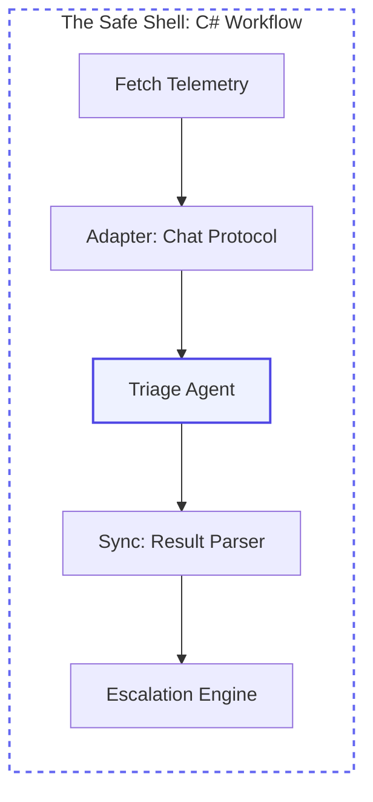

## Overview

Let's see how **Jordan Miller**—who we know from the previous journey as a senior on-call engineer—uses **Workflows** to handle a "SEV 1" incident. Jordan knows that the first few minutes of an outage are the most critical. They likely have a mental checklist: **Normalize** the messy logs, **Check** service health, and **Route** the incident to the correct team. When a major outage hits at 3 AM, Jordan doesn't want to rely on manual memory; they want the triage protocol codified.

In this module, we will help Jordan take their operational expertise and codify it into a structured, observable pipeline. We will decompose the triage process into discrete units called **Executors** and connect them with **Edges**. This allows Jordan to build a hybrid system where deterministic C# code handles business rules and probabilistic AI agents handle the complex reasoning.

## System Anatomy

We are now moving from the individual "Brain" and "Memory" to the **Orchestration** layer. This is where you define the "Assembly Line" that coordinates how Jordan's assistant actually works in a production environment.

<div class="grid grid-cols-2 md:grid-cols-3 lg:grid-cols-6 gap-3 my-10">
  <!-- Workflows (Mastered) -->
  <div class="p-4 rounded-xl bg-slate-50/50 border border-slate-200/60 shadow-sm opacity-50 grayscale transition-all hover:grayscale-0 hover:opacity-100">
    <div class="w-8 h-8 rounded-lg bg-white shadow-sm flex items-center justify-center text-lg mb-3 border border-slate-100">🔄</div>
    <div class="font-bold text-slate-900 mb-0.5 text-xs">Workflows</div>
    <p class="text-[10px] leading-relaxed text-slate-500">Graph execution.</p>
  </div>

  <!-- Executors (Active) -->
  <div class="p-4 rounded-xl bg-white border-2 border-indigo-500 shadow-md relative overflow-hidden transition-all hover:-translate-y-1">
    <div class="absolute top-0 right-0 px-1.5 py-0.5 bg-indigo-500 text-[8px] font-black text-white rounded-bl-lg tracking-tighter uppercase">Building</div>
    <div class="w-8 h-8 rounded-lg bg-indigo-50 flex items-center justify-center text-lg mb-3 border border-indigo-100">⚙️</div>
    <div class="font-bold text-slate-900 mb-0.5 text-xs">Executors</div>
    <p class="text-[10px] leading-relaxed text-slate-600 font-medium">Processing units.</p>
  </div>

  <!-- Edges (Active) -->
  <div class="p-4 rounded-xl bg-white border-2 border-indigo-500 shadow-md relative overflow-hidden transition-all hover:-translate-y-1">
    <div class="absolute top-0 right-0 px-1.5 py-0.5 bg-indigo-500 text-[8px] font-black text-white rounded-bl-lg tracking-tighter uppercase">Building</div>
    <div class="w-8 h-8 rounded-lg bg-indigo-50 flex items-center justify-center text-lg mb-3 border border-indigo-100">🔀</div>
    <div class="font-bold text-slate-900 mb-0.5 text-xs">Edges</div>
    <p class="text-[10px] leading-relaxed text-slate-600 font-medium">Message routing.</p>
  </div>

  <!-- Events (Active) -->
  <div class="p-4 rounded-xl bg-white border-2 border-indigo-500 shadow-md relative overflow-hidden transition-all hover:-translate-y-1">
    <div class="absolute top-0 right-0 px-1.5 py-0.5 bg-indigo-500 text-[8px] font-black text-white rounded-bl-lg tracking-tighter uppercase">Building</div>
    <div class="w-8 h-8 rounded-lg bg-indigo-50 flex items-center justify-center text-lg mb-3 border border-indigo-100">📊</div>
    <div class="font-bold text-slate-900 mb-0.5 text-xs">Events</div>
    <p class="text-[10px] leading-relaxed text-slate-600 font-medium">Observability.</p>
  </div>

  <!-- State (Upcoming) -->
  <div class="p-4 rounded-xl bg-slate-50/50 border border-slate-200/60 shadow-sm opacity-50 grayscale transition-all relative overflow-hidden hover:grayscale-0 hover:opacity-100">
    <div class="absolute top-0 right-0 px-1.5 py-0.5 bg-amber-500 text-[8px] font-black text-white rounded-bl-lg tracking-tighter uppercase">Upcoming</div>
    <div class="w-8 h-8 rounded-lg bg-white shadow-sm flex items-center justify-center text-lg mb-3 border border-slate-100">💾</div>
    <div class="font-bold text-slate-900 mb-0.5 text-xs">State</div>
    <p class="text-[10px] leading-relaxed text-slate-500">Resiliency.</p>
  </div>

  <!-- Hosting (Upcoming) -->
  <div class="p-4 rounded-xl bg-slate-50/50 border border-slate-200/60 shadow-sm opacity-50 grayscale transition-all relative overflow-hidden hover:grayscale-0 hover:opacity-100">
    <div class="absolute top-0 right-0 px-1.5 py-0.5 bg-amber-500 text-[8px] font-black text-white rounded-bl-lg tracking-tighter uppercase">Upcoming</div>
    <div class="w-8 h-8 rounded-lg bg-white shadow-sm flex items-center justify-center text-lg mb-3 border border-slate-100">☁️</div>
    <div class="font-bold text-slate-900 mb-0.5 text-xs">Hosting</div>
    <p class="text-[10px] leading-relaxed text-slate-500">Service boundary.</p>
  </div>
</div>




<div class="premium-gradient agent-mermaid-note">
<h4 class="text-indigo-950 font-black text-lg tracking-tight mb-2">The "Hybrid AI" Pattern</h4>
      <p class="text-sm leading-relaxed text-indigo-900/70">
        In Jordan's world, reliability is non-negotiable. This workflow implements the <strong>Hybrid AI Pattern</strong>: a "Smart Brain" wrapped in a "Safe Shell." 
      </p>
      <ul class="mt-4 space-y-2 text-xs text-indigo-900/60 list-none p-0">
        <li class="flex items-center gap-2">✅ <strong>Safety</strong>: C# handles high-stakes data fetching and final routing logic.</li>
        <li class="flex items-center gap-2">✅ <strong>Intelligence</strong>: The AI handles the "messy" interpretation of telemetry data.</li>
        <li class="flex items-center gap-2">✅ <strong>Protocol</strong>: We use specialized "bridge" executors to translate between deterministic types and Agentic Chat Protocol.</li>
      </ul>
</div>


## Setup your environment

If you are continuing from the previous tutorial, you can use your existing project. Otherwise, follow the steps below to initialize a new one.

<div class="solid-callout solid-callout-info mb-8">
  <p class="font-bold text-indigo-900 mb-3 text-base">📋 Pre-flight Checklist</p>
  <ul class="space-y-2.5 m-0 p-0 list-none text-sm text-indigo-900/80">
    <li class="flex items-center gap-2">🛠️ <strong>.NET 10.0 SDK</strong> (or later) installed.</li>
    <li class="flex items-center gap-2">🤖 <strong>AI Provider</strong>: Access to Azure OpenAI or a local service (Ollama/LM Studio).</li>
    <li class="flex items-center gap-2">🔄 <strong>Workflows</strong>: We will use the <code>Microsoft.Agents.AI.Workflows</code> package for orchestration.</li>
  </ul>
</div>

### <span class="step-pill">1</span> Install required packages

We focus on the orchestration package needed to build the assembly line.


  

#### OpenAI Compatible (LM Studio)

```bash
dotnet add package Microsoft.Agents.AI.Workflows
dotnet add package Microsoft.Agents.AI.OpenAI
dotnet restore
```

<div class="flex items-center gap-3 my-6 opacity-50">
  <div class="h-[1px] flex-1 bg-slate-200"></div>
  <span class="text-[10px] font-black uppercase tracking-widest text-slate-400">Package Anatomy</span>
  <div class="h-[1px] flex-1 bg-slate-200"></div>
</div>

<div class="grid grid-cols-1 md:grid-cols-2 gap-4 mb-6">
  <div class="p-4 rounded-xl border border-slate-200 bg-white shadow-sm hover:border-indigo-200 hover:shadow-md transition-all">
    <div class="flex items-center gap-2 mb-2">
      <span class="text-xl">🔄</span>
      <code class="text-xs font-bold text-indigo-600">Microsoft.Agents.AI.Workflows</code>
    </div>
    <p class="text-xs text-slate-500 leading-relaxed">The orchestration engine of the Agent Framework. It provides the base classes for <code class="text-[10px] bg-slate-100 px-1 rounded">Executor</code>, <code class="text-[10px] bg-slate-100 px-1 rounded">WorkflowBuilder</code>, and the graph-based execution runtime.</p>
  </div>
  <div class="p-4 rounded-xl border border-slate-200 bg-white shadow-sm hover:border-indigo-200 hover:shadow-md transition-all">
    <div class="flex items-center gap-2 mb-2">
      <span class="text-xl">🔌</span>
      <code class="text-xs font-bold text-indigo-600">Microsoft.Agents.AI.OpenAI</code>
    </div>
    <p class="text-xs text-slate-500 leading-relaxed">The core Agent Framework package. It provides the <code class="text-[10px] bg-slate-100 px-1 rounded">AsAIAgent</code> extension and state management abstractions.</p>
  </div>
</div>


  

#### Azure OpenAI

```bash
dotnet add package Microsoft.Agents.AI.Workflows
dotnet add package Microsoft.Agents.AI.OpenAI
dotnet restore
```

<div class="flex items-center gap-3 my-6 opacity-50">
  <div class="h-[1px] flex-1 bg-slate-200"></div>
  <span class="text-[10px] font-black uppercase tracking-widest text-slate-400">Package Anatomy</span>
  <div class="h-[1px] flex-1 bg-slate-200"></div>
</div>

<div class="grid grid-cols-1 md:grid-cols-2 gap-4 mb-6">
  <div class="p-4 rounded-xl border border-slate-200 bg-white shadow-sm hover:border-indigo-200 hover:shadow-md transition-all">
    <div class="flex items-center gap-2 mb-2">
      <span class="text-xl">🔄</span>
      <code class="text-xs font-bold text-indigo-600">Microsoft.Agents.AI.Workflows</code>
    </div>
    <p class="text-xs text-slate-500 leading-relaxed">The orchestration engine of the Agent Framework. It provides the base classes for <code class="text-[10px] bg-slate-100 px-1 rounded">Executor</code>, <code class="text-[10px] bg-slate-100 px-1 rounded">WorkflowBuilder</code>, and the graph-based execution runtime.</p>
  </div>
  <div class="p-4 rounded-xl border border-slate-200 bg-white shadow-sm hover:border-indigo-200 hover:shadow-md transition-all">
    <div class="flex items-center gap-2 mb-2">
      <span class="text-xl">🔌</span>
      <code class="text-xs font-bold text-indigo-600">Microsoft.Agents.AI.OpenAI</code>
    </div>
    <p class="text-xs text-slate-500 leading-relaxed">The core Agent Framework package. It provides the <code class="text-[10px] bg-slate-100 px-1 rounded">AsAIAgent</code> extension and state management abstractions.</p>
  </div>
</div>


## Build the Workflow

We are building a professional triage assembly line. This workflow doesn't just pass strings; it **extracts context**, **fetches telemetry**, and uses an **Agent** to analyze the impact before triggering an **escalation engine**.

```mermaid
graph LR
      Input([Raw Alert Text]) --> Fetch[Fetch Telemetry]
      Fetch -- "String" --> Adapter[Triage Adapter]
      Adapter -- "null" --> Triage[Triage Agent]
      Triage -- "List&lt;ChatMessage&gt;" --> Sync[Triage Sync]
      Sync -- "Report String" --> Escalate[Escalation Engine]
      Escalate --> Output([Final Decision])

      style Fetch fill:#f9f9ff,stroke:#6366f1,stroke-width:2px
      style Adapter fill:#fff7ed,stroke:#f97316,stroke-width:2px,stroke-dasharray: 5 5
      style Triage fill:#eef2ff,stroke:#4f46e5,stroke-width:3px
      style Sync fill:#fff7ed,stroke:#f97316,stroke-width:2px,stroke-dasharray: 5 5
      style Escalate fill:#f9f9ff,stroke:#6366f1,stroke-width:2px
```





<div class="agent-diagram-caption">
<p class="text-xs text-slate-400 mt-6 italic">The Protocol Pattern: Using Edges for structure and Chat Protocol for triggering reasoning.</p>
</div>


### <span class="step-pill">1</span> Implement the Workflow

Replace the contents of `Program.cs` with the code for your provider:


  

#### OpenAI Compatible (LM Studio)

```csharp
using Microsoft.Agents.AI;
using Microsoft.Agents.AI.Workflows;
using Microsoft.Extensions.AI;
using OpenAI.Chat;
using OpenAI;
using System.ClientModel;
using System.ComponentModel;
using ChatMessage = Microsoft.Extensions.AI.ChatMessage;

// 1. Setup Jordan's Agent
var endpoint = Environment.GetEnvironmentVariable("OPENAI_ENDPOINT") ?? "http://localhost:1234/v1";
var modelName = Environment.GetEnvironmentVariable("OPENAI_MODEL_NAME") ?? "google/gemma-4-e4b";
var chatClient = new OpenAIClient(new ApiKeyCredential("dummy"), new OpenAIClientOptions { Endpoint = new Uri(endpoint) })
    .GetChatClient(modelName);


AIAgent triageAgent = chatClient.AsAIAgent(new ChatClientAgentOptions
{
    Name = "TriageAgent",
    ChatOptions = new()
    {
        Instructions = """
            You are Jordan's on-call assistant. Analyze telemetry and classify incident priority.

            You MUST call AssessIncidentPriority before making a priority decision.
            Output only the tool-supported priority and a short reason:
            PRIORITY: P0 or PRIORITY: P1
            REASON: <one sentence>
            """,
        Tools = [AIFunctionFactory.Create(AssessIncidentPriority, nameof(AssessIncidentPriority))]
    }
});

// 2. Define the Pipeline Steps
var fetchTelemetry = new FetchTelemetryExecutor();
var triageAdapter = new TriageAdapterExecutor();
var triageSync = new TriageSyncExecutor();
var escalationEngine = new EscalationExecutor();
var triageAgentExecutor = triageAgent.BindAsExecutor(new AIAgentHostOptions
{
    ForwardIncomingMessages = false
});

// 3. Build the Assembly Line
WorkflowBuilder builder = new(fetchTelemetry);

builder.AddEdge(fetchTelemetry, triageAdapter);
builder.AddEdge(triageAdapter, triageAgentExecutor);
builder.AddEdge(triageAgentExecutor, triageSync);
builder.AddEdge(triageSync, escalationEngine);

var workflow = builder.Build();

// 4. Run the Workflow
var incident = "checkout failures in production";
ConsoleTheme.Jordan($"[JORDAN] Starting triage for: '{incident}'");
Console.WriteLine();

await using StreamingRun run = await InProcessExecution.RunStreamingAsync(workflow, incident);
bool wroteAgentHeader = false;
await foreach (WorkflowEvent evt in run.WatchStreamAsync())
{
    if (evt is AgentResponseUpdateEvent update && !string.IsNullOrEmpty(update.Update.Text))
    {
        if (!wroteAgentHeader)
        {
            ConsoleTheme.AgentHeader($"[{update.ExecutorId}] Agent response:");
            wroteAgentHeader = true;
        }

        ConsoleTheme.AgentChunk(update.Update.Text); // Stream the agent's thinking
    }
    else if (evt is WorkflowErrorEvent error)
    {
        ConsoleTheme.Error($"\n[ERROR] {error.Exception?.Message}");
    }
}
ConsoleTheme.Muted("\n[Workflow Complete]");

// --- Custom Executors & Adapters ---

[Description("Classifies incident priority from service telemetry using Jordan's deterministic triage thresholds.")]
static string AssessIncidentPriority(
    [Description("The service being triaged, such as checkout, payments, or inventory.")] string serviceName,
    [Description("The observed error rate percentage for the service.")] double errorRatePercent,
    [Description("The observed latency in milliseconds for the service.")] double latencyMs)
{
    bool isCritical = errorRatePercent >= 10 || latencyMs >= 400;
    string priority = isCritical ? "P0" : "P1";
    string reason = isCritical
        ? $"{serviceName} breaches the critical threshold: error rate {errorRatePercent}% and latency {latencyMs}ms."
        : $"{serviceName} is below the critical threshold: error rate {errorRatePercent}% and latency {latencyMs}ms.";

    return $"PRIORITY: {priority}\nREASON: {reason}";
}

internal sealed class FetchTelemetryExecutor() : Executor<string, string>("FetchTelemetry")
{
    public override ValueTask<string> HandleAsync(string service, IWorkflowContext context, CancellationToken ct = default)
    {
        string result = $"[TELEMETRY] Service: {service}, ErrorRate: 15%, Latency: 450ms";
        ConsoleTheme.Ok($"{this.Id}: Data fetched.");
        return ValueTask.FromResult(result);
    }
}

[SendsMessage(typeof(ChatMessage))]
[SendsMessage(typeof(TurnToken))]
internal sealed class TriageAdapterExecutor() : Executor<string>("TriageAdapter")
{
    public override async ValueTask HandleAsync(string message, IWorkflowContext context, CancellationToken ct = default)
    {
        ConsoleTheme.Ok($"{this.Id}: Translating to Chat Protocol...");

        // 1. Manually send the Chat Protocol messages to the context
        await context.SendMessageAsync(new ChatMessage(ChatRole.User, message), ct);
        await context.SendMessageAsync(new TurnToken(emitEvents: true), ct);

        // 2. Return nothing (void). 
        // The agent is triggered by the TurnToken, not by a returned value.
    }
}

internal sealed class TriageSyncExecutor() : Executor<List<ChatMessage>, string>("TriageSync")
{
    public override ValueTask<string> HandleAsync(List<ChatMessage> messages, IWorkflowContext context, CancellationToken ct = default)
    {
        // Extract only the Assistant's response to keep the report clean
        string report = string.Join("\n", messages
            .Where(m => m.Role == ChatRole.Assistant)
            .Select(m => m.Text ?? ""))
            .Trim();

        Console.WriteLine();
        ConsoleTheme.Ok($"{this.Id}: Prepared priority report for escalation.");
        return ValueTask.FromResult(report);
    }
}

internal sealed class EscalationExecutor() : Executor<string, string>("EscalationEngine")
{
    public override ValueTask<string> HandleAsync(string report, IWorkflowContext context, CancellationToken ct = default)
    {
        string decision = report.Contains("P0") ? "ALARM: Paging SRE Team." : "TICKET: Logged for triage.";
        Console.WriteLine();
        ConsoleTheme.Decision($"[FINAL DECISION] {decision}", isAlarm: decision.StartsWith("ALARM", StringComparison.Ordinal));
        return ValueTask.FromResult(decision);
    }
}

internal static class ConsoleTheme
{
    public static void Jordan(string message) => WriteLine(message, ConsoleColor.Cyan);

    public static void Ok(string message) => WriteLine($"[OK] {message}", ConsoleColor.Green);

    public static void AgentHeader(string message) => WriteLine(message, ConsoleColor.Magenta);

    public static void AgentChunk(string text) => Write(text, ConsoleColor.DarkYellow);

    public static void Decision(string message, bool isAlarm) => WriteLine(message, isAlarm ? ConsoleColor.Red : ConsoleColor.Green);

    public static void Error(string message) => WriteLine(message, ConsoleColor.Red);

    public static void Muted(string message) => WriteLine(message, ConsoleColor.DarkGray);

    private static void WriteLine(string message, ConsoleColor color)
    {
        Console.ForegroundColor = color;
        Console.WriteLine(message);
        Console.ResetColor();
    }

    private static void Write(string message, ConsoleColor color)
    {
        Console.ForegroundColor = color;
        Console.Write(message);
        Console.ResetColor();
    }
}
```


  

#### Azure OpenAI

```csharp
using Microsoft.Agents.AI;
using Microsoft.Agents.AI.Workflows;
using Microsoft.Extensions.AI;
using OpenAI.Chat;
using Azure.AI.OpenAI;
using Azure.Identity;
using System.ComponentModel;
using ChatMessage = Microsoft.Extensions.AI.ChatMessage;

// 1. Setup Jordan's Agent
var endpoint = Environment.GetEnvironmentVariable("AZURE_OPENAI_ENDPOINT")!;
var deploymentName = Environment.GetEnvironmentVariable("AZURE_OPENAI_DEPLOYMENT_NAME")!;
var chatClient = new AzureOpenAIClient(new Uri(endpoint), new DefaultAzureCredential())
    .GetChatClient(deploymentName);

AIAgent triageAgent = chatClient.AsAIAgent(new ChatClientAgentOptions
{
    Name = "TriageAgent",
    ChatOptions = new()
    {
        Instructions = """
            You are Jordan's on-call assistant. Analyze telemetry and classify incident priority.

            You MUST call AssessIncidentPriority before making a priority decision.
            Output only the tool-supported priority and a short reason:
            PRIORITY: P0 or PRIORITY: P1
            REASON: <one sentence>
            """,
        Tools = [AIFunctionFactory.Create(AssessIncidentPriority, nameof(AssessIncidentPriority))]
    }
});

// 2. Define the Pipeline Steps
var fetchTelemetry = new FetchTelemetryExecutor();
var triageAdapter = new TriageAdapterExecutor();
var triageSync = new TriageSyncExecutor();
var escalationEngine = new EscalationExecutor();
var triageAgentExecutor = triageAgent.BindAsExecutor(new AIAgentHostOptions
{
    ForwardIncomingMessages = false
});

// 3. Build the Assembly Line
WorkflowBuilder builder = new(fetchTelemetry);

builder.AddEdge(fetchTelemetry, triageAdapter);
builder.AddEdge(triageAdapter, triageAgentExecutor);
builder.AddEdge(triageAgentExecutor, triageSync);
builder.AddEdge(triageSync, escalationEngine);

var workflow = builder.Build();

// 4. Run the Workflow
var incident = "checkout failures in production";
ConsoleTheme.Jordan($"[JORDAN] Starting triage for: '{incident}'");
Console.WriteLine();

await using StreamingRun run = await InProcessExecution.RunStreamingAsync(workflow, incident);
bool wroteAgentHeader = false;
await foreach (WorkflowEvent evt in run.WatchStreamAsync())
{
    if (evt is AgentResponseUpdateEvent update && !string.IsNullOrEmpty(update.Update.Text))
    {
        if (!wroteAgentHeader)
        {
            ConsoleTheme.AgentHeader($"[{update.ExecutorId}] Agent response:");
            wroteAgentHeader = true;
        }

        ConsoleTheme.AgentChunk(update.Update.Text);
    }
    else if (evt is WorkflowErrorEvent error)
    {
        ConsoleTheme.Error($"\n[ERROR] {error.Exception?.Message}");
    }
}
ConsoleTheme.Muted("\n[Workflow Complete]");

// --- Custom Executors & Adapters ---

[Description("Classifies incident priority from service telemetry using Jordan's deterministic triage thresholds.")]
static string AssessIncidentPriority(
    [Description("The service being triaged, such as checkout, payments, or inventory.")] string serviceName,
    [Description("The observed error rate percentage for the service.")] double errorRatePercent,
    [Description("The observed latency in milliseconds for the service.")] double latencyMs)
{
    bool isCritical = errorRatePercent >= 10 || latencyMs >= 400;
    string priority = isCritical ? "P0" : "P1";
    string reason = isCritical
        ? $"{serviceName} breaches the critical threshold: error rate {errorRatePercent}% and latency {latencyMs}ms."
        : $"{serviceName} is below the critical threshold: error rate {errorRatePercent}% and latency {latencyMs}ms.";

    return $"PRIORITY: {priority}\nREASON: {reason}";
}

internal sealed class FetchTelemetryExecutor() : Executor<string, string>("FetchTelemetry")
{
    public override ValueTask<string> HandleAsync(string service, IWorkflowContext context, CancellationToken ct = default)
    {
        string result = $"[TELEMETRY] Service: {service}, ErrorRate: 15%, Latency: 450ms";
        ConsoleTheme.Ok($"{this.Id}: Data fetched.");
        return ValueTask.FromResult(result);
    }
}

[SendsMessage(typeof(ChatMessage))]
[SendsMessage(typeof(TurnToken))]
internal sealed class TriageAdapterExecutor() : Executor<string>("TriageAdapter")
{
    public override async ValueTask HandleAsync(string message, IWorkflowContext context, CancellationToken ct = default)
    {
        ConsoleTheme.Ok($"{this.Id}: Translating to Chat Protocol...");

        // 1. Manually send the Chat Protocol messages to the context
        await context.SendMessageAsync(new ChatMessage(ChatRole.User, message), ct);
        await context.SendMessageAsync(new TurnToken(emitEvents: true), ct);

        // 2. Return nothing (void). 
        // The agent is triggered by the TurnToken, not by a returned value.
    }
}

internal sealed class TriageSyncExecutor() : Executor<List<ChatMessage>, string>("TriageSync")
{
    public override ValueTask<string> HandleAsync(List<ChatMessage> messages, IWorkflowContext context, CancellationToken ct = default)
    {
        // Extract only the Assistant's response to keep the report clean
        string report = string.Join("\n", messages
            .Where(m => m.Role == ChatRole.Assistant)
            .Select(m => m.Text ?? ""))
            .Trim();

        Console.WriteLine();
        ConsoleTheme.Ok($"{this.Id}: Prepared priority report for escalation.");
        return ValueTask.FromResult(report);
    }
}

internal sealed class EscalationExecutor() : Executor<string, string>("EscalationEngine")
{
    public override ValueTask<string> HandleAsync(string report, IWorkflowContext context, CancellationToken ct = default)
    {
        string decision = report.Contains("P0") ? "ALARM: Paging SRE Team." : "TICKET: Logged for triage.";
        Console.WriteLine();
        ConsoleTheme.Decision($"[FINAL DECISION] {decision}", isAlarm: decision.StartsWith("ALARM", StringComparison.Ordinal));
        return ValueTask.FromResult(decision);
    }
}

internal static class ConsoleTheme
{
    public static void Jordan(string message) => WriteLine(message, ConsoleColor.Cyan);

    public static void Ok(string message) => WriteLine($"[OK] {message}", ConsoleColor.Green);

    public static void AgentHeader(string message) => WriteLine(message, ConsoleColor.Magenta);

    public static void AgentChunk(string text) => Write(text, ConsoleColor.DarkYellow);

    public static void Decision(string message, bool isAlarm) => WriteLine(message, isAlarm ? ConsoleColor.Red : ConsoleColor.Green);

    public static void Error(string message) => WriteLine(message, ConsoleColor.Red);

    public static void Muted(string message) => WriteLine(message, ConsoleColor.DarkGray);

    private static void WriteLine(string message, ConsoleColor color)
    {
        Console.ForegroundColor = color;
        Console.WriteLine(message);
        Console.ResetColor();
    }

    private static void Write(string message, ConsoleColor color)
    {
        Console.ForegroundColor = color;
        Console.Write(message);
        Console.ResetColor();
    }
}
```


### <span class="step-pill">2</span> The Chat Protocol Bridge

AI Agents don't just process strings; they reason over a conversation history. The **TriageAdapter** bridges this gap:
1.  **ChatMessage**: It converts the raw telemetry string into a `ChatMessage` with a `User` role.
2.  **TurnToken**: It sends a signal telling the Agent "The input is complete, please start reasoning."

By returning **void** (nothing) from the adapter while manually sending the messages, we ensure the Agent logic is triggered by the official protocol signals instead of by a returned value.

The agent also receives a deterministic tool: `AssessIncidentPriority`. Instead of guessing whether telemetry is critical, Jordan's Agent must call the tool and base its `PRIORITY: P0` or `PRIORITY: P1` output on Jordan's operational thresholds.

The agent is also bound with <code>ForwardIncomingMessages = false</code>. This matters because an Agent executor can otherwise forward the incoming user message downstream before it sends the assistant response. Without this setting, <code>TriageSync</code> would see two separate <code>List<ChatMessage></code> deliveries: first the forwarded user message, then the assistant response. For this workflow, the sync step should parse only Jordan's assistant report.

<div class="solid-callout solid-callout-info my-8">
  <p class="font-bold text-indigo-900 mb-2 text-base">🛡️ Protocol Validation with [SendsMessage]</p>
  <p class="text-sm text-indigo-900/80 leading-relaxed m-0">
    The <code>[SendsMessage]</code> attribute isn't just for documentation. It enables <strong>Protocol Validation</strong>. By declaring that <code>TriageAdapter</code> sends <code>ChatMessage</code> and <code>TurnToken</code>, the <code>WorkflowBuilder</code> can verify that your graph is correctly connected before you even hit "Run."
  </p>
</div>

### <span class="step-pill">3</span> Run and Observe the Story

Execute the app:
```bash
dotnet run
```

**Understanding the Execution Pipeline:**
1.  **Deterministic Preparation**: We begin by fetching telemetry using standard C# code. This ensures the data is clean and structured before the AI ever sees it.
2.  **The Protocol Bridge**: The `TriageAdapter` translates our C# string into the `ChatMessage` format and signals the Agent to begin.
3.  **Tool-Grounded Investigation**: Jordan's Agent receives the message, calls `AssessIncidentPriority`, and bases its priority on deterministic telemetry thresholds. Because we used `RunStreamingAsync`, you can see the agent's response stream in the terminal in real-time.
4.  <strong>The Sync</strong>: Since the Agent outputs a conversational list (<code>List<ChatMessage></code>), the <code>TriageSync</code> executor extracts the core report so the final <code>EscalationEngine</code> can make a deterministic decision.
5.  **Deterministic Escalation**: The final decision is handled by a **Safe Shell**. Based on the Agent's priority rating, this engine pages the team for "P0" incidents.

## Try it

Experiment with the "Safe Shell" by modifying the deterministic rules and telemetry that guide the workflow.


  

#### 🎯 Threshold Tweak

### Modify Business Rules
In a real-world scenario, "Critical" thresholds might change. Update the `AssessIncidentPriority` method in `Program.cs`:

```csharp
// Change the latency threshold to be more sensitive (from 400 to 200)
bool isCritical = errorRatePercent >= 10 || latencyMs >= 200;
```

**Result:** The agent will now classify lower-latency incidents as `P0`, and the `EscalationEngine` will trigger an ALARM for issues that were previously just tickets.


  

#### 📟 Telemetry Shift

### Test Different Scenarios
Swap the mocked telemetry data in `FetchTelemetryExecutor` to see how the assembly line handles a "Healthy" result:

```csharp
public override ValueTask<string> HandleAsync(string service, IWorkflowContext context, CancellationToken ct = default)
{
    // Simulate a healthy service
    string result = $"[TELEMETRY] Service: {service}, ErrorRate: 0.5%, Latency: 45ms";
    ConsoleTheme.Ok($"{this.Id}: Data fetched.");
    return ValueTask.FromResult(result);
}
```

**Result:** The agent will see the healthy stats, the tool will return `PRIORITY: P1`, and the `EscalationEngine` will log a TICKET instead of paging the team.


  

#### 🎭 Agent Persona

### Change the Tone
Even in a deterministic workflow, you can adjust the agent's "thinking." Update the `Instructions` in your `triageAgent` setup:

```csharp
Instructions = """
    You are a highly Technical Lead Responder. 
    Focus heavily on the infrastructure implications of the telemetry.
    Keep your REASON technical and brief.
    """,
```

**Result:** While the final decision (P0/P1) remains deterministic because of the tool call, the technical summary provided by the agent will shift in tone and detail.


## Summary & Next Steps

You've now helped **Jordan** move from building a "Chatty Agent" to building a **Reliable Process**. By using Workflows, Jordan has ensured that their on-call triage protocol is followed exactly as defined, every time.

*   **Executors**: Jordan's automated "Runbook" steps (C# or AI).
*   **Edges**: The "Pipes" that move data through the triage pipeline.
*   **Events**: The "Logs" that give Jordan 100% observability into what happened during the incident.

In the **[next tutorial](/post/agent-framework/academy/advanced-orchestration/state-and-checkpoints/)**, we will ensure Jordan's triage assembly line is resilient to failures by implementing **Shared State** and **Checkpoints**.
