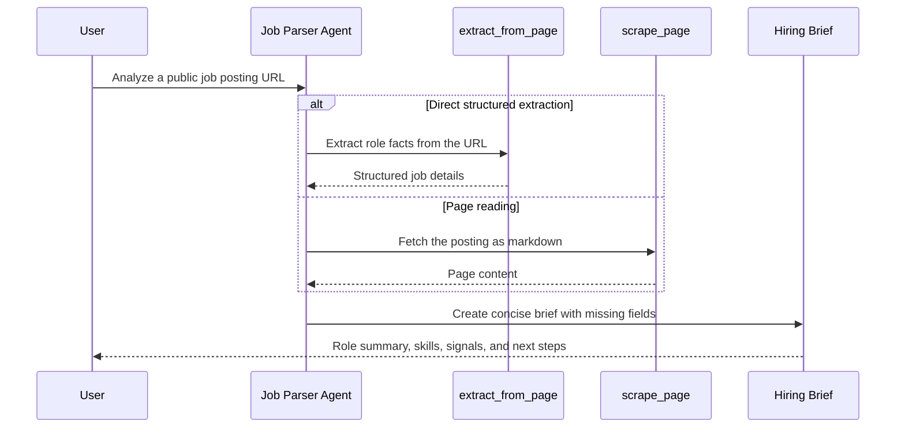

## Overview

Hiring pages are packed with useful information, but they are rarely shaped for quick decisions. A recruiter wants intake notes. A candidate wants preparation guidance. A hiring manager wants a quick check on role scope, seniority, and required skills. Everyone is looking at the same public job posting, but each person needs it turned into a practical brief.

In this tutorial, you will build a **Job Page Parser** with **Microsoft Agent Framework** and **ScrapeGraphAI.AgentFramework**. The agent takes a public job posting URL, reads or extracts the important role facts, and returns a concise hiring brief with a source URL.

The workflow is intentionally simple:

1. Provide a public job posting URL.
2. Choose direct extraction or page reading.
3. Preserve missing or uncertain fields.
4. Return a brief a person can act on.

## Agent Anatomy

An extraction agent still needs a persona and a brain, but the most important capability is the bridge from a messy public page to structured role facts.

<div class="grid grid-cols-1 sm:grid-cols-2 lg:grid-cols-5 gap-4 my-10">
  <!-- Persona (Mastered) -->
  <div class="p-5 rounded-2xl bg-slate-50/50 border border-slate-200/60 shadow-sm opacity-50 grayscale transition-all hover:grayscale-0 hover:opacity-100 animate-fade-in">
    <div class="w-10 h-10 rounded-xl bg-white shadow-sm flex items-center justify-center text-xl mb-4 border border-slate-100">🎭</div>
    <div class="font-bold text-slate-900 mb-1 text-sm">Persona</div>
    <p class="text-[11px] leading-relaxed text-slate-500">A concise hiring analyst.</p>
  </div>

  <!-- Brain (Mastered) -->
  <div class="p-5 rounded-2xl bg-slate-50/50 border border-slate-200/60 shadow-sm opacity-50 grayscale transition-all hover:grayscale-0 hover:opacity-100 animate-fade-in animate-delay-1">
    <div class="w-10 h-10 rounded-xl bg-white shadow-sm flex items-center justify-center text-xl mb-4 border border-slate-100">🧠</div>
    <div class="font-bold text-slate-900 mb-1 text-sm">Brain</div>
    <p class="text-[11px] leading-relaxed text-slate-500">Reasoning about role fit.</p>
  </div>

  <!-- Extractor (Active) -->
  <div class="p-5 rounded-2xl bg-white border-2 border-indigo-500 shadow-xl shadow-indigo-500/10 transition-all hover:-translate-y-1 relative overflow-hidden animate-fade-in animate-delay-2">
    <div class="absolute top-0 right-0 px-2 py-0.5 bg-indigo-500 text-[9px] font-black text-white rounded-bl-lg tracking-tighter uppercase">Building</div>
    <div class="w-10 h-10 rounded-xl bg-indigo-50 flex items-center justify-center text-xl mb-4 border border-indigo-100">🧾</div>
    <div class="font-bold text-slate-900 mb-1 text-sm">Extractor</div>
    <p class="text-[11px] leading-relaxed text-slate-600 font-medium"><code>extract_from_page</code> pulls role facts.</p>
  </div>

  <!-- Reader (Active) -->
  <div class="p-5 rounded-2xl bg-white border-2 border-indigo-500 shadow-xl shadow-indigo-500/10 transition-all hover:-translate-y-1 relative overflow-hidden animate-fade-in animate-delay-3">
    <div class="absolute top-0 right-0 px-2 py-0.5 bg-indigo-500 text-[9px] font-black text-white rounded-bl-lg tracking-tighter uppercase">Building</div>
    <div class="w-10 h-10 rounded-xl bg-indigo-50 flex items-center justify-center text-xl mb-4 border border-indigo-100">📖</div>
    <div class="font-bold text-slate-900 mb-1 text-sm">Reader</div>
    <p class="text-[11px] leading-relaxed text-slate-600 font-medium"><code>scrape_page</code> returns page text.</p>
  </div>

  <!-- Brief (Result) -->
  <div class="p-5 rounded-2xl bg-slate-50/50 border border-slate-200/60 shadow-sm opacity-50 grayscale transition-all hover:grayscale-0 hover:opacity-100 animate-fade-in animate-delay-4">
    <div class="absolute top-0 right-0 px-2 py-0.5 bg-amber-500 text-[9px] font-black text-white rounded-bl-lg tracking-tighter uppercase">Result</div>
    <div class="w-10 h-10 rounded-xl bg-white shadow-sm flex items-center justify-center text-xl mb-4 border border-slate-100">📌</div>
    <div class="font-bold text-slate-900 mb-1 text-sm">Brief</div>
    <p class="text-[11px] leading-relaxed text-slate-500">Role summary and next steps.</p>
  </div>
</div>

<div class="premium-gradient border border-indigo-100 rounded-3xl p-8 my-12 shadow-sm relative overflow-hidden animate-fade-in animate-delay-4">
  <div class="absolute -top-10 -right-10 w-40 h-40 bg-indigo-500/5 rounded-full blur-3xl"></div>
  <div class="flex gap-5 relative z-10">
    <div class="flex-shrink-0 w-12 h-12 rounded-2xl bg-indigo-600 flex items-center justify-center text-white shadow-lg shadow-indigo-200">
      <svg xmlns="http://www.w3.org/2000/svg" width="24" height="24" viewBox="0 0 24 24" fill="none" stroke="currentColor" stroke-width="2.5" stroke-linecap="round" stroke-linejoin="round"><path d="M2 3h6a4 4 0 0 1 4 4v14a3 3 0 0 0-3-3H2z"/><path d="M22 3h-6a4 4 0 0 0-4 4v14a3 3 0 0 1 3-3h7z"/></svg>
    </div>
    <div>
      <h4 class="text-indigo-950 font-black text-lg tracking-tight mb-2">From Page Content to Business Action</h4>
      <p class="text-sm leading-relaxed text-indigo-900/70 max-w-2xl">
        A job posting is not just text. It contains requirements, seniority signals, team priorities, and hidden hints about the hiring process. <code>extract_from_page</code> is best when you need fields. <code>scrape_page</code> is best when you want the agent to read the page and write a more flexible brief.
      </p>
    </div>
  </div>
</div>

## Setup your environment

Create a console app and install the packages that connect Agent Framework, OpenAI-compatible chat, and ScrapeGraphAI tools.

<div class="solid-callout solid-callout-info mb-8">
  <p class="font-bold text-indigo-900 mb-3 text-base">📋 Pre-flight Checklist</p>
  <ul class="space-y-2.5 m-0 p-0 list-none text-sm text-indigo-900/80">
    <li class="flex items-center gap-2">🛠️ <strong>.NET 10.0 SDK</strong> (or later) installed.</li>
    <li class="flex items-center gap-2">🤖 <strong>AI Provider</strong>: An OpenAI-compatible endpoint such as LM Studio, Ollama, OpenAI, or a compatible hosted service.</li>
    <li class="flex items-center gap-2">🔑 <strong>ScrapeGraphAI</strong>: A valid <code>SGAI_API_KEY</code> for web scraping and extraction.</li>
    <li class="flex items-center gap-2">🌐 <strong>Job URL</strong>: A public job posting page you are allowed to access.</li>
  </ul>
</div>

### <span class="step-pill">1</span> Create the project

Open your terminal and create a new console application:

```bash
dotnet new console -n ScrapeGraphAI.JobPageParser -f net10.0
cd ScrapeGraphAI.JobPageParser
```

### <span class="step-pill">2</span> Install packages

Install the ScrapeGraphAI Agent Framework integration, the OpenAI-compatible Agent Framework bridge, and the supporting configuration packages.

```bash
dotnet add package ScrapeGraphAI.AgentFramework --version 1.0.0
dotnet add package Microsoft.Agents.AI.OpenAI
dotnet add package Microsoft.Extensions.Configuration
dotnet add package Microsoft.Extensions.DependencyInjection
dotnet add package Microsoft.Extensions.Logging.Console
dotnet add package OpenAI
dotnet restore
```

<div class="flex items-center gap-3 my-6 opacity-50">
  <div class="h-[1px] flex-1 bg-slate-200"></div>
  <span class="text-[10px] font-black uppercase tracking-widest text-slate-400">Package Anatomy</span>
  <div class="h-[1px] flex-1 bg-slate-200"></div>
</div>

<div class="grid grid-cols-1 md:grid-cols-3 gap-4 mb-8">
  <div class="p-4 rounded-xl border border-slate-200 bg-white shadow-sm hover:border-indigo-200 hover:shadow-md transition-all">
    <div class="flex items-center gap-2 mb-2">
      <span class="text-xl">🛠️</span>
      <code class="text-xs font-bold text-indigo-600">ScrapeGraphAI.AgentFramework</code>
    </div>
    <p class="text-xs text-slate-500 leading-relaxed">Registers ScrapeGraphAI web, scrape, extract, crawl, monitor, history, health, and credit tools as Agent Framework <code>AITool</code> instances.</p>
  </div>
  <div class="p-4 rounded-xl border border-slate-200 bg-white shadow-sm hover:border-indigo-200 hover:shadow-md transition-all">
    <div class="flex items-center gap-2 mb-2">
      <span class="text-xl">🔌</span>
      <code class="text-xs font-bold text-indigo-600">Microsoft.Agents.AI.OpenAI</code>
    </div>
    <p class="text-xs text-slate-500 leading-relaxed">Provides the Agent Framework OpenAI integration and the <code>AsAIAgent</code> extension used to build the agent.</p>
  </div>
  <div class="p-4 rounded-xl border border-slate-200 bg-white shadow-sm hover:border-indigo-200 hover:shadow-md transition-all">
    <div class="flex items-center gap-2 mb-2">
      <span class="text-xl">🤖</span>
      <code class="text-xs font-bold text-indigo-600">OpenAI</code>
    </div>
    <p class="text-xs text-slate-500 leading-relaxed">Creates an OpenAI-compatible chat client. This works with local endpoints such as LM Studio as well as hosted compatible services.</p>
  </div>
</div>

### <span class="step-pill">3</span> Configure credentials

Before setting environment variables, get your ScrapeGraphAI API key from the dashboard.

<div class="solid-callout solid-callout-info my-6">
  <p class="font-bold text-indigo-900 mb-2 text-sm">Get your ScrapeGraphAI API key</p>
  <ol class="space-y-1.5 m-0 p-0 list-decimal list-inside text-xs text-indigo-900/80">
    <li>Sign in to the <a href="https://scrapegraphai.com/" target="_blank" rel="noreferrer">ScrapeGraphAI dashboard</a>.</li>
    <li>Open <strong>Settings</strong>.</li>
    <li>Copy the API key from the <strong>API Key</strong> section.</li>
    <li>Store it in an environment variable named <code>SGAI_API_KEY</code>.</li>
  </ol>
  <p class="text-xs text-indigo-900/70 leading-relaxed mt-3">
    The official docs describe the same flow in <a href="https://docs.scrapegraphai.com/knowledge-base/account/api-keys" target="_blank" rel="noreferrer">Managing your API keys</a>. Keep the key server-side, never commit it to source control, and rotate it from Settings if it is exposed.
  </p>
</div>

Set the ScrapeGraphAI key and your OpenAI-compatible chat endpoint.


  

#### PowerShell

```powershell
$env:SGAI_API_KEY = "<your-scrapegraphai-api-key>"
$env:OPENAI_BASE_URL = "http://localhost:1234/v1"
$env:OPENAI_MODEL = "<your-tool-capable-model>"
$env:OPENAI_API_KEY = "lm-studio"
```


  

#### Bash

```bash
export SGAI_API_KEY="<your-scrapegraphai-api-key>"
export OPENAI_BASE_URL="http://localhost:1234/v1"
export OPENAI_MODEL="<your-tool-capable-model>"
export OPENAI_API_KEY="lm-studio"
```


For LM Studio, the API key can be a placeholder. For a hosted OpenAI-compatible endpoint, use the real API key required by that provider.

## Build the job parser

The agent starts with one ScrapeGraphAI tool at a time. Use the tabs below to choose the behavior you want to teach.



## Choose the tool

ScrapeGraphAI charges different credit amounts depending on the service and format you call. For this tutorial's two job-posting paths, the important baseline is:

- `scrape_page` with markdown output: **1 credit** for a basic page scrape.
- `extract_from_page`: **5 credits** for structured data extraction.

See the official [ScrapeGraphAI pricing page](https://docs.scrapegraphai.com/knowledge-base/account/pricing) and [Scrape service pricing](https://docs.scrapegraphai.com/services/scrape) for the latest credit table before running high-volume workflows.

<div class="grid grid-cols-1 md:grid-cols-2 gap-4 my-8">
  <div class="p-5 rounded-2xl border-2 border-indigo-200 bg-white shadow-sm">
    <div class="font-bold text-indigo-950 mb-1 text-sm">Use <code>extract_from_page</code> when...</div>
    <p class="text-xs text-slate-600 leading-relaxed">You know the fields you want: role title, company, skills, responsibilities, seniority, work mode, and unclear fields. It costs more because ScrapeGraphAI performs structured extraction, but it is the better default for repeatable business workflows.</p>
  </div>
  <div class="p-5 rounded-2xl border border-slate-200 bg-white shadow-sm">
    <div class="font-bold text-slate-900 mb-1 text-sm">Use <code>scrape_page</code> when...</div>
    <p class="text-xs text-slate-600 leading-relaxed">You want the page content first: markdown, summaries, links, or a more exploratory brief where the agent decides what matters from the posting text. Markdown scraping is cheaper, but the model must infer the structure from the returned content.</p>
  </div>
</div>

### <span class="step-pill">1</span> Implement the Agent and Tools <span class="agent-heading-chip">🎭 Persona</span> <span class="agent-heading-chip">🛠️ Tools</span>

Replace the contents of `Program.cs` with one of these complete programs:


  

#### ExtractFromPage

```csharp
using Microsoft.Agents.AI;
using Microsoft.Extensions.AI;
using Microsoft.Extensions.Configuration;
using Microsoft.Extensions.DependencyInjection;
using Microsoft.Extensions.Logging;
using OpenAI;
using OpenAI.Chat;
using ScrapeGraphAI;
using ScrapeGraphAI.AgentFramework;
using System.ClientModel;

const string DefaultJobUrl = "https://example.com/careers/software-engineer";

var runAgent = args.Contains("--run", StringComparer.OrdinalIgnoreCase);
var jobUrl = GetOption(args, "--url") ?? DefaultJobUrl;
var prompt = GetOption(args, "--prompt") ?? $"""
Analyze this job posting: {jobUrl}.
Extract the role title, company, location, work mode, seniority, required skills,
preferred skills, responsibilities, hiring signals, and candidate preparation notes.
Return a concise brief with source URL.
""";

var endpoint = GetOption(args, "--endpoint")
    ?? Environment.GetEnvironmentVariable("OPENAI_BASE_URL")
    ?? Environment.GetEnvironmentVariable("LMSTUDIO_BASE_URL")
    ?? "http://localhost:1234/v1";

var configuration = new ConfigurationBuilder()
    .AddInMemoryCollection(new Dictionary<string, string?>
    {
        ["OpenAI:ApiKey"] = Environment.GetEnvironmentVariable("OPENAI_API_KEY") ?? "lm-studio",
        ["OpenAI:Model"] = GetOption(args, "--model")
            ?? Environment.GetEnvironmentVariable("OPENAI_MODEL")
            ?? Environment.GetEnvironmentVariable("LMSTUDIO_MODEL")
            ?? "google/gemma-4-e4b",
        ["OpenAI:Endpoint"] = endpoint,
        ["ScrapeGraphAI:ApiKey"] = Environment.GetEnvironmentVariable("SGAI_API_KEY")
            ?? (runAgent ? null : "sgai-placeholder")
    })
    .Build();

var openAiApiKey = configuration["OpenAI:ApiKey"];
var model = configuration["OpenAI:Model"]!;
var openAiEndpoint = configuration["OpenAI:Endpoint"]!;
var scrapeGraphApiKey = configuration["ScrapeGraphAI:ApiKey"];

using var cancellation = new CancellationTokenSource();
Console.CancelKeyPress += (_, eventArgs) =>
{
    eventArgs.Cancel = true;
    cancellation.Cancel();
};

var services = new ServiceCollection();
services.Configure<ScrapeGraphOptions>(configuration.GetSection("ScrapeGraphAI"));
services.AddLogging(logging =>
{
    logging.AddSimpleConsole(options => options.SingleLine = true);
    logging.SetMinimumLevel(LogLevel.Warning);
});

services.AddScrapeGraphAI()
    .ConfigureHttpClient(client =>
    {
        client.Timeout = TimeSpan.FromSeconds(90);
    });

services.AddScrapeGraphAgentTools(options =>
{
    options.MaxResultCharacters = 12_000;
    options.IncludedTools =
    [
        ScrapeGraphAgentToolNames.ExtractFromPage
    ];
});

await using var provider = services.BuildServiceProvider();
var loggerFactory = provider.GetRequiredService<ILoggerFactory>();
var scrapeGraphTools = provider.GetRequiredService<ScrapeGraphAgentTools>();
var aiTools = scrapeGraphTools
    .AsAITools(
        ScrapeGraphAgentToolNames.ExtractFromPage)
    .ToArray();

Console.WriteLine("ScrapeGraphAI job page parser");
Console.WriteLine();
Console.WriteLine($"Model: {model}");
Console.WriteLine($"OpenAI-compatible endpoint: {openAiEndpoint}");
Console.WriteLine($"Job URL: {jobUrl}");
Console.WriteLine("Registered tools:");
foreach (AITool tool in aiTools)
{
    Console.WriteLine($"- {tool.Name}: {tool.Description}");
}
Console.WriteLine();

if (!runAgent)
{
    Console.WriteLine("No API calls were made. Add --run after setting SGAI_API_KEY and starting your model endpoint.");
    return 0;
}

if (string.IsNullOrWhiteSpace(openAiApiKey))
{
    Console.Error.WriteLine("Set OPENAI_API_KEY before running with --run, or use a local endpoint placeholder such as lm-studio.");
    return 2;
}

if (string.IsNullOrWhiteSpace(scrapeGraphApiKey))
{
    Console.Error.WriteLine("Set SGAI_API_KEY before running with --run.");
    return 2;
}

if (!Uri.TryCreate(openAiEndpoint, UriKind.Absolute, out var endpointUri))
{
    Console.Error.WriteLine($"Invalid OpenAI-compatible endpoint: {openAiEndpoint}");
    return 2;
}

var chatClient = new ChatClient(
    model,
    new ApiKeyCredential(openAiApiKey),
    new OpenAIClientOptions
    {
        Endpoint = endpointUri
    });

var agent = chatClient.AsAIAgent(
    name: "JobPageParser",
    instructions: """
        You are a concise hiring analyst.

        For job posting analysis:
        - Use extract_from_page before answering.
        - Prefer structured extraction for role facts from the URL.
        - Preserve uncertainty when a field is missing or unclear.
        - Do not invent company details, compensation, seniority, or work mode.
        - Return a practical brief, not a generic summary.
        - Include the source URL.
        - End with one recommended next action.
        """,
    tools: aiTools,
    clientFactory: innerClient => new FunctionInvokingChatClient(innerClient, loggerFactory, provider)
    {
        MaximumIterationsPerRequest = 10
    },
    loggerFactory: loggerFactory,
    services: provider);

Console.WriteLine("Prompt:");
Console.WriteLine(prompt);
Console.WriteLine();
Console.WriteLine("Response:");

var response = await agent.RunAsync(prompt, cancellationToken: cancellation.Token).ConfigureAwait(false);
Console.WriteLine(response.Text);

return 0;

static string? GetOption(string[] args, string name)
{
    for (var i = 0; i < args.Length; i++)
    {
        if (string.Equals(args[i], name, StringComparison.OrdinalIgnoreCase) && i + 1 < args.Length)
        {
            return args[i + 1];
        }

        var prefix = name + "=";
        if (args[i].StartsWith(prefix, StringComparison.OrdinalIgnoreCase))
        {
            return args[i][prefix.Length..];
        }
    }

    return null;
}
```


  

#### ScrapePage

```csharp
using Microsoft.Agents.AI;
using Microsoft.Extensions.AI;
using Microsoft.Extensions.Configuration;
using Microsoft.Extensions.DependencyInjection;
using Microsoft.Extensions.Logging;
using OpenAI;
using OpenAI.Chat;
using ScrapeGraphAI;
using ScrapeGraphAI.AgentFramework;
using System.ClientModel;

const string DefaultJobUrl = "https://example.com/careers/software-engineer";

var runAgent = args.Contains("--run", StringComparer.OrdinalIgnoreCase);
var jobUrl = GetOption(args, "--url") ?? DefaultJobUrl;
var prompt = GetOption(args, "--prompt") ?? $"""
Analyze this job posting: {jobUrl}.
Read the page, identify the role title, company, location, work mode, seniority,
required skills, preferred skills, responsibilities, hiring signals, and candidate preparation notes.
Return a concise brief with source URL.
""";

var endpoint = GetOption(args, "--endpoint")
    ?? Environment.GetEnvironmentVariable("OPENAI_BASE_URL")
    ?? Environment.GetEnvironmentVariable("LMSTUDIO_BASE_URL")
    ?? "http://localhost:1234/v1";

var configuration = new ConfigurationBuilder()
    .AddInMemoryCollection(new Dictionary<string, string?>
    {
        ["OpenAI:ApiKey"] = Environment.GetEnvironmentVariable("OPENAI_API_KEY") ?? "lm-studio",
        ["OpenAI:Model"] = GetOption(args, "--model")
            ?? Environment.GetEnvironmentVariable("OPENAI_MODEL")
            ?? Environment.GetEnvironmentVariable("LMSTUDIO_MODEL")
            ?? "google/gemma-4-e4b",
        ["OpenAI:Endpoint"] = endpoint,
        ["ScrapeGraphAI:ApiKey"] = Environment.GetEnvironmentVariable("SGAI_API_KEY")
            ?? (runAgent ? null : "sgai-placeholder")
    })
    .Build();

var openAiApiKey = configuration["OpenAI:ApiKey"];
var model = configuration["OpenAI:Model"]!;
var openAiEndpoint = configuration["OpenAI:Endpoint"]!;
var scrapeGraphApiKey = configuration["ScrapeGraphAI:ApiKey"];

using var cancellation = new CancellationTokenSource();
Console.CancelKeyPress += (_, eventArgs) =>
{
    eventArgs.Cancel = true;
    cancellation.Cancel();
};

var services = new ServiceCollection();
services.Configure<ScrapeGraphOptions>(configuration.GetSection("ScrapeGraphAI"));
services.AddLogging(logging =>
{
    logging.AddSimpleConsole(options => options.SingleLine = true);
    logging.SetMinimumLevel(LogLevel.Warning);
});

services.AddScrapeGraphAI()
    .ConfigureHttpClient(client =>
    {
        client.Timeout = TimeSpan.FromSeconds(90);
    });

services.AddScrapeGraphAgentTools(options =>
{
    options.DefaultFormat = ScrapeFormatType.Markdown;
    options.MaxResultCharacters = 12_000;
    options.IncludedTools =
    [
        ScrapeGraphAgentToolNames.ScrapePage
    ];
});

await using var provider = services.BuildServiceProvider();
var loggerFactory = provider.GetRequiredService<ILoggerFactory>();
var scrapeGraphTools = provider.GetRequiredService<ScrapeGraphAgentTools>();
var aiTools = scrapeGraphTools
    .AsAITools(
        ScrapeGraphAgentToolNames.ScrapePage)
    .ToArray();

Console.WriteLine("ScrapeGraphAI job page parser");
Console.WriteLine();
Console.WriteLine($"Model: {model}");
Console.WriteLine($"OpenAI-compatible endpoint: {openAiEndpoint}");
Console.WriteLine($"Job URL: {jobUrl}");
Console.WriteLine("Registered tools:");
foreach (AITool tool in aiTools)
{
    Console.WriteLine($"- {tool.Name}: {tool.Description}");
}
Console.WriteLine();

if (!runAgent)
{
    Console.WriteLine("No API calls were made. Add --run after setting SGAI_API_KEY and starting your model endpoint.");
    return 0;
}

if (string.IsNullOrWhiteSpace(openAiApiKey))
{
    Console.Error.WriteLine("Set OPENAI_API_KEY before running with --run, or use a local endpoint placeholder such as lm-studio.");
    return 2;
}

if (string.IsNullOrWhiteSpace(scrapeGraphApiKey))
{
    Console.Error.WriteLine("Set SGAI_API_KEY before running with --run.");
    return 2;
}

if (!Uri.TryCreate(openAiEndpoint, UriKind.Absolute, out var endpointUri))
{
    Console.Error.WriteLine($"Invalid OpenAI-compatible endpoint: {openAiEndpoint}");
    return 2;
}

var chatClient = new ChatClient(
    model,
    new ApiKeyCredential(openAiApiKey),
    new OpenAIClientOptions
    {
        Endpoint = endpointUri
    });

var agent = chatClient.AsAIAgent(
    name: "JobPageParser",
    instructions: """
        You are a concise hiring analyst.

        For job posting analysis:
        - Use scrape_page before answering.
        - Read the returned markdown carefully before writing the brief.
        - Preserve uncertainty when a field is missing or unclear.
        - Do not invent company details, compensation, seniority, or work mode.
        - Return a practical brief, not a generic summary.
        - Include the source URL.
        - End with one recommended next action.
        """,
    tools: aiTools,
    clientFactory: innerClient => new FunctionInvokingChatClient(innerClient, loggerFactory, provider)
    {
        MaximumIterationsPerRequest = 10
    },
    loggerFactory: loggerFactory,
    services: provider);

Console.WriteLine("Prompt:");
Console.WriteLine(prompt);
Console.WriteLine();
Console.WriteLine("Response:");

var response = await agent.RunAsync(prompt, cancellationToken: cancellation.Token).ConfigureAwait(false);
Console.WriteLine(response.Text);

return 0;

static string? GetOption(string[] args, string name)
{
    for (var i = 0; i < args.Length; i++)
    {
        if (string.Equals(args[i], name, StringComparison.OrdinalIgnoreCase) && i + 1 < args.Length)
        {
            return args[i + 1];
        }

        var prefix = name + "=";
        if (args[i].StartsWith(prefix, StringComparison.OrdinalIgnoreCase))
        {
            return args[i][prefix.Length..];
        }
    }

    return null;
}
```


### <span class="step-pill">2</span> Run a dry registration check

Run the app without `--run` first. This checks that dependency injection and tool registration work without calling ScrapeGraphAI or your model endpoint.

<div class="solid-callout solid-callout-info my-6">
  <p class="font-bold text-indigo-900 mb-2 text-sm">Credit-safe dry run</p>
  <p class="text-xs text-indigo-900/80 leading-relaxed">
    Running without <code>--run</code> only prints configuration and registered tools. It does not call ScrapeGraphAI, does not call your model endpoint, and should not consume ScrapeGraphAI credits.
  </p>
</div>

```bash
dotnet run
```

Expected output:


  

#### ExtractFromPage

```text
ScrapeGraphAI job page parser

Model: <your model>
OpenAI-compatible endpoint: http://localhost:1234/v1
Job URL: https://example.com/careers/software-engineer
Registered tools:
- extract_from_page: Extract structured JSON from a URL, raw HTML, or markdown using a natural-language prompt.

No API calls were made. Add --run after setting SGAI_API_KEY and starting your model endpoint.
```


  

#### ScrapePage

```text
ScrapeGraphAI job page parser

Model: <your model>
OpenAI-compatible endpoint: http://localhost:1234/v1
Job URL: https://example.com/careers/software-engineer
Registered tools:
- scrape_page: Fetch a URL and return content in markdown, HTML, links, images, summary, JSON, branding, or screenshot format.

No API calls were made. Add --run after setting SGAI_API_KEY and starting your model endpoint.
```


### <span class="step-pill">3</span> Run the agent

Once your model endpoint is running and `SGAI_API_KEY` is set, pass a real public job posting URL:

<div class="solid-callout solid-callout-warning my-6">
  <p class="font-bold text-amber-900 mb-2 text-sm">ScrapeGraphAI credit usage</p>
  <p class="text-xs text-amber-900/80 leading-relaxed">
    Running with <code>--run</code> can consume ScrapeGraphAI credits because the selected tool fetches or extracts from the target page. In the default tutorial paths, markdown <code>scrape_page</code> starts at 1 credit, while <code>extract_from_page</code> starts at 5 credits. Use a small number of test URLs while developing, and avoid repeatedly running against the same page unless you are intentionally testing the live workflow.
  </p>
</div>

```bash
dotnet run --run --url "https://example.com/careers/software-engineer"
```

The answer will vary because the agent is working from live page content, but it should identify role facts, list missing fields, and provide a concrete next step.

## Try it

Run these prompts with either `Program.cs` tab. Prefer `ExtractFromPage` for repeatable field extraction, and `ScrapePage` when the agent needs more room to interpret the posting text.


  

#### Candidate prep

```bash
dotnet run --run --url "https://example.com/careers/software-engineer" --prompt "Analyze this job posting for a candidate. Summarize must-have skills, likely interview topics, gaps to prepare for, and a 3-step study plan. Include the source URL."
```

Works with either approach. Use `ScrapePage` when you want a richer narrative brief; use `ExtractFromPage` when you want the prep plan grounded in specific extracted fields.


  

#### Recruiter intake

```bash
dotnet run --run --url "https://example.com/careers/software-engineer" --prompt "Analyze this job posting for recruiter intake. Extract role title, team, location, seniority, must-have skills, nice-to-have skills, screening questions, and unclear fields. Include the source URL."
```

Best with `ExtractFromPage` because the output depends on stable fields a recruiter can reuse for sourcing, screening, or handoff notes.


  

#### Skills gap

```bash
dotnet run --run --url "https://example.com/careers/software-engineer" --prompt "Analyze this job posting and create a skills gap checklist for a candidate with C# and Azure experience but limited frontend experience. Include required skills, matching strengths, gaps, and next learning steps."
```

Often better with `ScrapePage` because the agent can reason across the full posting text, but `ExtractFromPage` is useful when you want the gap analysis tied to explicit required and preferred skills.


  

#### Interview questions

```bash
dotnet run --run --url "https://example.com/careers/software-engineer" --prompt "Analyze this job posting and generate 8 interview questions mapped to the role's required skills and responsibilities. Include the source URL."
```

Often better with `ScrapePage` because interview questions benefit from the posting's full context, tone, and responsibilities.


## Guardrails for job-page agents

Job postings often omit important details. The agent should treat missing information as missing, not as an invitation to guess.

<div class="solid-callout solid-callout-warning my-6">
  <p class="font-bold text-amber-900 mb-2 text-sm">Do not invent hiring facts</p>
  <p class="text-xs text-amber-900/80 leading-relaxed">
    This tutorial intentionally registers one ScrapeGraphAI tool at a time. Whether you choose <code>extract_from_page</code> or <code>scrape_page</code>, the agent should not infer compensation, remote policy, sponsorship, seniority, or interview process unless the page provides evidence. Missing fields should be called out explicitly.
  </p>
</div>

The most important prompt rules are:

- Use the selected ScrapeGraphAI tool before answering.
- Preserve the source URL.
- Separate required skills from preferred skills.
- Mark missing or ambiguous fields.
- Avoid guessing compensation, work mode, or seniority.
- Keep the final brief short enough to use in a hiring workflow.

## What to build next

This tutorial gives you a useful first job-page workflow. From here, you can grow the agent in four directions:

<div class="grid grid-cols-1 md:grid-cols-2 gap-4 my-8">
  <div class="p-5 rounded-2xl border border-slate-200 bg-white shadow-sm">
    <div class="font-bold text-slate-900 mb-1 text-sm">Structured Output</div>
    <p class="text-xs text-slate-500 leading-relaxed">Add a JSON schema so the brief can feed an ATS, CRM, or spreadsheet.</p>
  </div>
  <div class="p-5 rounded-2xl border border-slate-200 bg-white shadow-sm">
    <div class="font-bold text-slate-900 mb-1 text-sm">Multi-page Career Research</div>
    <p class="text-xs text-slate-500 leading-relaxed">Add crawl tools to inspect multiple postings from the same careers site.</p>
  </div>
  <div class="p-5 rounded-2xl border border-slate-200 bg-white shadow-sm">
    <div class="font-bold text-slate-900 mb-1 text-sm">Posting Monitor</div>
    <p class="text-xs text-slate-500 leading-relaxed">Add monitor tools to detect when a role changes or disappears.</p>
  </div>
  <div class="p-5 rounded-2xl border border-slate-200 bg-white shadow-sm">
    <div class="font-bold text-slate-900 mb-1 text-sm">Candidate Matcher</div>
    <p class="text-xs text-slate-500 leading-relaxed">Compare extracted role requirements with a candidate profile or resume summary.</p>
  </div>
</div>

## Summary

You built a focused job-page parser that turns a public posting into a role brief. The key move was comparing two narrow tool paths before adding more capability:

```text
job URL -> extract_from_page -> hiring brief
job URL -> scrape_page -> hiring brief
```

That loop is simple enough to debug, useful enough for recruiters or candidates, and strong enough to become the base for structured output, monitoring, and candidate matching.
